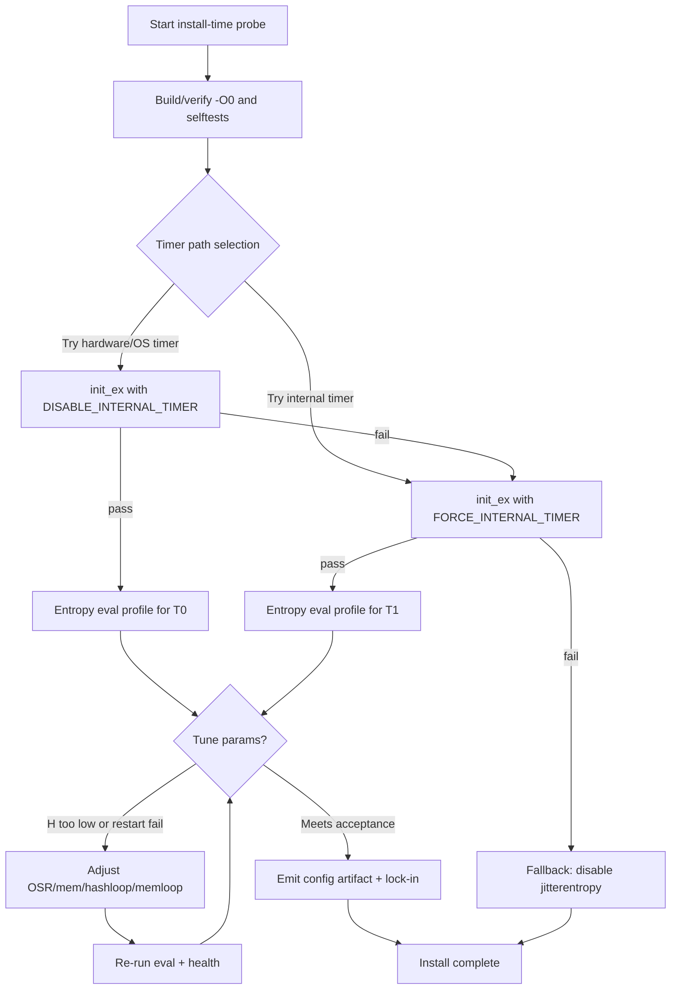

# Sistema de autoconfiguración en instalación para CPU-jitter NPTRNG de jitterentropy-library

## Resumen ejecutivo

El “CPU-jitter NPTRNG” implementado en **jitterentropy-library** es un generador basado en la variación temporal (“jitter”) de la ejecución de bloques de código (ruido de CPU) medida con un contador/temporizador de alta resolución; su seguridad práctica depende fuertemente de la **calidad del temporizador**, del **grado real de variación** que introduce la microarquitectura y el sistema operativo, y de activar y respetar los **health tests** al estilo NIST SP 800-90B (especialmente en modo FIPS). El propio upstream insiste en que la condición mínima es disponer de un **temporizador de alta resolución** (prerrequisito), y proporciona un conjunto de **herramientas de grabación y validación** para estimar min-entropía según SP 800-90B en una plataforma concreta. citeturn30view0turn33view2

Para diseñar un sistema **automático** de autoconfiguración “en el momento de instalación” (install-time), lo más robusto —y alineado con SP 800-90B— es tratar la configuración como un problema de **selección empírica reproducible**:

- **Seleccionar ruta de temporizado**: (a) temporizador “hardware/OS” (la ruta estándar `jent_get_nstime`) vs (b) temporizador interno “timer-less” basado en hilo contador (si está compilado y hay ≥2 cores). La librería ya ejecuta un *power-up self test* que detecta temporizador grueso, no monotónico, stuck, o variación insuficiente; y puede forzar el temporizador interno si se compila y se solicita. citeturn18view4turn17view2turn52view3  
- **Medir min-entropía por muestra (H)** con un procedimiento SP 800-90B-like: recolectar ≥1,000,000 muestras y, si se pretende evaluación completa, pruebas de reinicio con matriz 1000×1000 (1000 reinicios × 1000 muestras). citeturn43view0turn43view2turn33view2  
- **Ajustar parámetros** que controlan: tamaño de memoria y patrón de acceso, recuentos de bucle “hash” y “memaccess”, OSR (oversampling rate), flags de temporizador interno, y modos FIPS/NTG1. Estos parámetros existen como combinaciones de (i) **opciones compile-time** en `src/jitterentropy-internal.h` y CMake, y (ii) **flags/runtime args** vía `jent_entropy_init_ex()`/`jent_entropy_collector_alloc()` y flags codificados en `jitterentropy.h`. citeturn49view1turn52view2turn48view0turn9view0  
- **Validar con health tests activos**: en la librería, el reporte/accionamiento de fallos de health tests está condicionado por `fips_enabled`; si no se fuerza FIPS (o el OS no está en FIPS), se puede “quedar ciego” a fallos de RCT/APT/LAG/RCT-mem. citeturn14view0turn29view0turn47view4  
- **Emitir un artefacto reproducible** (JSON/TOML) con: versión/commit, temporizador elegido, flags, OSR, parámetros derivados (memoria/hashloop), resultados de min-entropía y reinicios, y acciones de fallback. El upstream ya incluye un API `jent_status` que expone (en JSON) configuración y entorno (cores y cachés) y banderas relevantes. citeturn28view2turn28view3  

Limitación importante de fuentes: la solicitud pide priorizar el PDF de Chronox. En este entorno no fue posible descargar ni el PDF ni su HTML desde `chronox.de/jent/doc/...` (errores de servidor). Se compensa con el **código fuente upstream**, la **man page** del repo y la **página Chronox de Jitter RNG** (todas fuentes primarias del mismo autor), además de NIST SP 800-90B/90C y documentación auxiliar. citeturn30view0turn29view0turn43view0turn43view4  

## Fuentes y alcance de la extracción

La extracción de parámetros, umbrales y puntos de tuning en este informe se basa principalmente en:

- **API/flags y códigos de error**: `jitterentropy.h`. citeturn48view0  
- **Macros de configuración y defaults** (OSR min/max, memory bits, cache shift, bucles hash/mem, máscara APT, habilitación de LAG, patrón memaccess, safety factor): `src/jitterentropy-internal.h`. citeturn49view1turn51view0turn49view4turn49view5turn50view0  
- **Selección/derivación de memoria y hashloop desde caché + caps**, y la **política de recuperación incremental** (`jent_read_entropy_safe`): `src/jitterentropy-base.c`. citeturn52view2turn52view4turn18view0turn18view3  
- **Health tests y umbrales**: RCT/APT/LAG/RCT-mem (lookup tables y fórmulas): `src/jitterentropy-health.c` y `src/jitterentropy-health.h`. citeturn14view0turn13view1turn12view0turn21view0  
- **Ruido, muestreo, domain separation y fórmula del número de muestras por bloque**: `src/jitterentropy-noise.c`. citeturn16view0turn15view0turn15view1turn31view1  
- **Temporizador interno (hilo contador)** y su política (≥2 cores, start/stop por solicitud, fuerza global): `src/jitterentropy-timer.c` y `src/jitterentropy-timer.h`. citeturn17view0turn17view2turn21view2  
- **Cálculo/uso del GCD del temporizador** y condición de variación mínima: `src/jitterentropy-gcd.c`. citeturn27view0turn27view2  
- **Acondicionamiento (SHA3/SHAKE/XDRBG) y tamaños**: `src/jitterentropy-sha3.h`, `src/jitterentropy-sha3.c`. citeturn21view4turn25view2turn25view0turn39view4  
- **Exposición de estado para reproducibilidad**: `src/jitterentropy-status.c` (`jent_status`). citeturn28view2turn28view3  
- **Opciones de compilación/CMake**: `CMakeLists.txt` (INTERNAL_TIMER, EXTERNAL_CRYPTO, AARCH64_NSTIME_REGISTER, STACK_PROTECTOR). citeturn9view0  
- **Herramientas oficiales de test del repo**: `tests/raw-entropy/...` (grabación runtime y restart, y pipeline con NIST Entropy Assessment Tool). citeturn33view1turn34view0turn33view2turn36view0turn37view0turn37view1  
- **Marco normativo**: NIST SP 800-90B (tamaño mínimo de datasets y reinicios; requisitos de health tests; mínimo 1024 muestras en startup tests) y NIST SP 800-90C (marco RBG). citeturn43view0turn43view2turn44view1turn44view3turn43view4  
- **Análisis complementario** (en inglés) por Joshua Hill sobre evaluación de JEnt vs SP800-90B (enfatiza temporizador interno, ejecutar init, consistencia y condiciones típicas de fallo). citeturn47view1turn47view3turn47view4  

Idioma de la mayoría de estas fuentes: inglés (NIST, repo, Chronox, notas). citeturn43view0turn29view0turn30view0  

## Arquitectura técnica y puntos de control que determinan la calidad de entropía

### Flujo de datos de jitterentropy-library

El pipeline de generación (versión actual del repo) se puede resumir así:

1. Se toman **deltas temporales** (`current_delta`) midiendo diferencias entre lecturas de tiempo, normalizadas por el **GCD común** del temporizador (`jent_common_timer_gcd`). citeturn16view0turn27view2turn19view0  
2. Se aplica `jent_stuck` sobre la primera, segunda y tercera derivada (delta, delta2, delta3). Si alguna es cero, se considera “stuck” y se alimentan los health tests (RCT, APT, LAG, RCT-mem). citeturn14view0turn13view3  
3. En paralelo se ejecutan **dos fuentes de “ruido medido”**:
   - **Memory access loop** (patrón pseudoaleatorio por defecto; determinista en mediciones NTG1 específicas), que altera memoria y afecta el tiempo de ejecución. citeturn15view1turn31view0turn49view1  
   - **Hash loop** (SHA3-256 sobre datos auxiliares) ejecutado N veces, cuyo tiempo de ejecución aporta jitter medible; su salida se considera “additional information” (sin entropía en sí) pero evita optimizaciones y mezcla estado para impedir que el compilador elimine el trabajo. citeturn15view1turn52view0  
4. Se inyectan `current_delta` y datos intermedios en el estado `hash_state` (SHAKE/XDRBG), con **domain separation** distinta según la etapa (0x01 mem NTG1, 0x02 hash NTG1, 0x03 runtime). citeturn31view1turn16view0turn15view0  
5. Se repite el muestreo hasta completar `(DATA_SIZE_BITS + safety_factor) * osr` mediciones aceptadas (no-stuck), donde `DATA_SIZE_BITS=256` y `safety_factor` vale `ENTROPY_SAFETY_FACTOR=65` cuando `fips_enabled`, o 0 fuera de FIPS. citeturn16view0turn49view5  
6. Se extrae un bloque (hasta 256 bits) desde el XDRBG y se entrega al usuario. citeturn16view0turn25view3  

Mermaid (dataflow) para localizar exactamente dónde actúan parámetros y tests:

```mermaid
flowchart TD
  A[Timer read: jent_get_nstime_internal] --> B[delta = (t - prev)/gcd]
  B --> C[jent_stuck: delta, delta2, delta3]
  C -->|stuck| HT[Health tests update: RCT/APT/LAG/RCT-mem]
  C -->|not stuck| HT
  B --> MA[Memory access loop\n(memaccessloops, memsize, pattern)]
  B --> HL[Hash loop\n(hashloopcnt, SHA3)]
  HT --> INS[Hash insert + domain sep\n0x01/0x02/0x03]
  MA --> INS
  HL --> INS
  INS --> STATE[hash_state (SHAKE/XDRBG)]
  STATE --> OUT[jent_read_random_block -> output]
  OUT --> BT[Backtracking hardening\n(optional if not secure mem)]
```

citeturn16view0turn15view2turn14view0turn52view4turn25view3  

### Qué hace que una plataforma “sea apta” o falle

La librería ejecuta *startup tests* que, en la práctica, son un filtro duro de plataforma/temporizador:

- **Temporizador “no funciona”** (lecturas 0) → ENOTIME. citeturn18view4turn47view3  
- **Delta 0 o temporizador demasiado grueso** → ECOARSETIME. citeturn18view4turn47view3  
- **Demasiados stuck** (por defecto >90% en init) → ESTUCK (`JENT_STUCK_INIT_THRES`). citeturn49view1turn18view4turn47view3  
- **No monotonicidad** (más de 3 retrocesos durante init para tolerar NTP/adjtime) → ENOMONOTONIC. citeturn18view4  
- **Variación insuficiente** medida por GCD/análisis: si la suma de diferencias no satisface el umbral relativo a OSR (`(delta_sum * osr) < nelem`) → EMINVARVAR. citeturn27view2turn18view4turn47view3  
- **Fallo de health tests en init** → EHEALTH o ERCT. citeturn18view4turn29view0  

Para un autoconfigurador install-time, estos códigos no son “errores a ocultar”: son **señales diagnósticas** para decidir (a) ruta de temporizador y (b) si el método es viable en esa plataforma.

## Diseño del sistema de autoconfiguración en instalación

### Objetivo operativo

Durante la instalación (o primer arranque determinista), ejecutar un “probe” que:

1. Pruebe rutas de temporizador (hardware/OS vs interno), y se quede con la mejor (o la única que pasa). citeturn18view4turn17view2turn47view1  
2. Estime min-entropía por muestra (`H`) de los deltas (raw noise) y verifique health tests en condiciones de ejecución real, conforme a SP 800-90B-like. citeturn33view2turn43view0turn44view3turn14view0  
3. Seleccione un conjunto de parámetros (OSR, memoria, hashloop, temporizador interno sí/no, flags FIPS/NTG1, etc.). citeturn48view0turn49view4turn52view2  
4. Emita un artefacto reproducible y comprobable (`jent_config.json`) y defina fallback si no alcanza criterios.

### Flujo automatizado propuesto

Este flujo está pensado para ser reproducible y con reglas claras (y suficientemente “auditable” para un laboratorio o revisión interna).

#### Fase de preflight

- Registrar: versión de la librería (`jent_version()`), arquitectura, nº de cores (`jent_ncpu()`), tamaños de caché reportados por `jent_cache_size_roundup`, y si hay soporte real de memoria “segura” (`jent_secure_memory_supported()`). Idealmente, volcar `jent_status` para baseline. citeturn52view1turn28view2turn28view3turn8view0  
- Asegurar compilación **sin optimizaciones** (`-O0`), porque el código falla en build si detecta `__OPTIMIZE__`. Esto debe ser parte del sistema de build del probe (y del artefacto final). citeturn52view0turn37view0turn9view0  

#### Fase de selección del temporizador

Candidatos:

- **T0: hardware/OS timer (default path)**: `jent_entropy_init_ex(osr, flags | JENT_DISABLE_INTERNAL_TIMER)` (si no se fuerza interno). citeturn18view4turn18view4  
- **T1: temporizador interno “timer-less”**: `jent_entropy_init_ex(osr, flags | JENT_FORCE_INTERNAL_TIMER)` *si* se compiló `JENT_CONF_ENABLE_INTERNAL_TIMER` y hay ≥2 cores; si no, debería fallar o ser inusable. citeturn21view2turn17view0turn17view2  

Reglas:

- Si T0 pasa y T1 pasa, medir min-entropía en ambos y escoger el **mínimo** como claim si la instalación quiere ser conservadora; alternativamente escoger el que maximiza `H` con margen y reduce fallos (la presentación de Hill sugiere evaluar consistentemente con el mismo clock source que el desplegado). citeturn47view1turn47view4  
- Si T0 falla con ECOARSETIME/ESTUCK/EMINVARVAR y T1 pasa, seleccionar T1. citeturn18view4turn17view2  
- Si ambos fallan, marcar jitterentropy como **no apto** y activar fallback. citeturn29view0turn30view0  

#### Fase de exploración/tuning de parámetros

Propuesta: búsqueda por etapas, evitando un grid search explosivo.

1. **Baseline runtime flags**:
   - Activar `JENT_FORCE_FIPS` en las pruebas para que `fips_enabled` esté activo y los health tests no queden silenciados (y se aplique el safety factor). citeturn48view0turn14view0turn16view0turn47view4  
   - Si se requiere NTG.1 (AIS 20/31), activar `JENT_NTG1` y recordar que esto fuerza FIPS y deshabilita el temporizador interno según la lógica de asignación. citeturn18view1turn19view0turn29view0  

2. **OSR (Oversampling Rate)**:
   - Inicial: `osr=0` en la API, que se eleva a mínimo `JENT_MIN_OSR=3`. citeturn52view1turn49view4turn29view0  
   - Ajuste: si el estimador de min-entropía entrega `H`, fijar `osr >= ceil(1/H)` (siendo conservadores) y dentro de `JENT_MAX_OSR=20`. Además, el propio `jent_read_entropy_safe` aplicará incrementos automáticos de OSR ante fallos intermitentes hasta `JENT_MAX_OSR`. citeturn52view4turn49view4turn27view2  

3. **Memoria para memaccess (tamaño y derivación desde caché)**:
   - Por defecto, si el usuario no fija `JENT_MAX_MEMSIZE_*`, `jent_update_memsize` deriva el tamaño desde la caché (L1 por defecto o todas si `JENT_CACHE_ALL`), aplica un multiplicador y lo capea por `JENT_MAX_MEMSIZE_MAX`. La lógica incluye un aumento extra (equivalente a ×4) si solo usa L1 para fomentar “L1 misses y L2 hits”. citeturn52view2turn48view0turn31view0  
   - Ajuste install-time: probar 2–4 valores de `JENT_MAX_MEMSIZE_*` alrededor de:
     - ~4× L1 (baseline)  
     - ~tamaño “all caches” (si memoria lo permite)  
     - un escalón superior si `H` es bajo o si reinicios fallan. citeturn52view2turn48view0turn34view0turn33view1  

4. **Hash loop count (runtime flag vs default)**:
   - Runtime: usar flags `JENT_HASHLOOP_*` (1..128) codificados en el bitfield del `flags`. citeturn48view0turn36view0  
   - Compile-time default: `JENT_HASH_LOOP_DEFAULT=1` y multiplicador de init `JENT_HASH_LOOP_INIT=3`. citeturn49view4turn16view0  
   - Estrategia: subir `JENT_HASHLOOP_*` si:
     - `H` es bajo al medir hashloop “solo” (`--hashloop` en hashtime), o  
     - la plataforma es virtualizada/embebida con poca variación. citeturn36view0turn33view1turn49view3  

5. **Memaccess loop counts**:
   - Default compile-time: `JENT_MEM_ACC_LOOP_DEFAULT=128`, init multiplier `JENT_MEM_ACC_LOOP_INIT=3`. citeturn49view3turn31view1  
   - En NTG.1, la fase `jent_measure_jitter_ntg1_memaccess` invoca el memaccess determinista con `ec->memaccessloops * JENT_MEM_ACC_LOOP_INIT` para asegurar suficiente variación en L2/L3/RAM. citeturn31view1turn16view0  
   - Estrategia: si H(memaccess) es bajo, aumentar primero **memoria** (más probable que fuerce misses/cambios de caché) antes de aumentar loops; si aún es insuficiente, aumentar `JENT_MEM_ACC_LOOP_DEFAULT`. citeturn31view0turn52view2turn49view3  

6. **APT mask**:
   - Default: `JENT_APT_MASK = 0xffff...ffff` (sin truncación). El propio comentario upstream desaconseja truncación previa al APT porque empeora tasa de falsos positivos y potencia estadística; NIST habría retirado una propuesta de truncación anterior. citeturn49view2turn51view0  
   - Recomendación install-time: **no tocar** salvo que un análisis específico de plataforma muestre bits bajos “muertos” incluso tras dividir por GCD, y que una máscara alternativa mejora tests sin degradarlos.

7. **Lag predictor (JENT_HEALTH_LAG_PREDICTOR)**:
   - Está habilitado por defecto como macro compile-time; añade detección de patrones deterministas repetidos (fallo mode explícito). citeturn49view1turn47view4  
   - Recomendación: mantenerlo activado en virtualización y embebidos donde pueden emerger patrones. citeturn47view4  

8. **Patrón de acceso a memoria (JENT_RANDOM_MEMACCESS)**:
   - Por defecto se activa (excepto cuando se compila para medir “raw memory access”, donde se fuerza determinista). citeturn49view1turn16view0  
   - Recomendación install-time:
     - para **runtime común**, conservar el default upstream;  
     - para **medición** del aporte específico de L2/L3/RAM, usar el modo determinista (tal como hace el tooling NTG.1). citeturn33view1turn31view1  

#### Fase de validación y decisión final

Criterios de aceptación recomendados (y cómo medirlos):

- **Init**: `jent_entropy_init_ex(osr, flags_temporizador|flags_fips|...) == 0`. citeturn29view0turn18view4  
- **Health tests en operación**:
  - No fallos permanentes (`JENT_*_FAILURE_PERMANENT`) bajo una carga de generación suficiente. citeturn52view3turn14view0turn48view0  
  - Tolerancia a fallos intermitentes: si se usa `jent_read_entropy_safe`, la librería reintenta con realocación e incrementa OSR/mem/hashloop en escalones; si llega a `JENT_MAX_OSR`, considera no apto. citeturn18view0turn52view4turn49view4  
- **Min-entropía (SP800-90B-like)**:
  - Dataset secuencial: ≥1,000,000 muestras raw. citeturn43view0turn33view2  
  - Restart tests: 1000 reinicios × 1000 muestras, si el objetivo es alta confianza (y especialmente si se pretende un claim formal). citeturn43view0turn43view2turn34view0  
  - Evaluación: usar la herramienta NIST SP800-90B Entropy Assessment Tool (EAT) como propone el propio repo (`validation-runtime`). citeturn33view2  

Salida: escoger el “perfil” que (a) pasa init/health, (b) maximiza min-entropía con margen, (c) cumple requisitos operativos (latencia/CPU/RAM), y (d) queda documentado en un artefacto reproducible.

### Árbol de decisión install-time



citeturn52view2turn18view4turn17view2turn33view2turn43view0turn52view4  

### Diagrama temporal para muestreo (OSR y safety factor)

En modo FIPS, un bloque condicionado de 256 bits usa `ENTROPY_SAFETY_FACTOR = 65`, y el bucle de generación corta en `((256 + 65) * osr)` muestras “válidas” (no-stuck); fuera de FIPS, es `256 * osr`. citeturn16view0turn49view5  

```mermaid
gantt
  title Generación de un bloque condicionado (conceptual)
  dateFormat  X
  axisFormat  %L

  section Setup
  Prime prev_time (runtime stage) :a0, 0, 1

  section Sampling loop
  Repeat measure_jitter (valid sample) :a1, 1, 256
  Extra samples for OSR multiplier     :a2, 257, 256
  Safety margin samples (FIPS)         :a3, 513, 65

  section Output
  XDRBG generate 256-bit block         :a4, 578, 2
```



Nota: el diagrama es conceptual; en realidad, `osr` multiplica el conteo total, y las repeticiones por “stuck” y checks de health pueden introducir trabajo adicional y/o descartar el bloque. citeturn16view0turn14view0turn52view3  

## Catálogo de parámetros y opciones con acciones recomendadas

A continuación incluyo una tabla **machine-readable (CSV)** que cubre: macros/constantes (compile-time), flags/runtime APIs (runtime), campos de estado relevantes, umbrales de health tests y opciones de build/test que afectan recolección, muestreo, bufferizado/estado, acondicionamiento (“whitening”) y health tests.

**Cómo leerla**:
- `type`: `compile`, `runtime`, `api`, `struct`, `test`.
- `default`: el valor por defecto en el repo actual (cuando aplica) o “derived” si depende de otros parámetros (por ejemplo, `apt_cutoff` depende de `osr`).
- `range`: rangos válidos según código (cuando están codificados).
- `location`: fichero y “contexto” (macro/función/estructura) para encontrar la definición exacta.

**Cobertura de fuentes para la tabla**: `jitterentropy.h`, `src/jitterentropy-internal.h`, `src/jitterentropy-base.c`, `src/jitterentropy-health.{c,h}`, `src/jitterentropy-noise.c`, `src/jitterentropy-timer.{c,h}`, `src/jitterentropy-gcd.c`, `src/jitterentropy-sha3.{c,h}`, `jitterentropy-base-user.h`, `CMakeLists.txt`, y el harness `tests/.../jitterentropy-hashtime.c` más scripts. citeturn48view0turn51view0turn52view2turn14view0turn16view0turn17view2turn27view2turn25view2turn8view0turn9view0turn36view0turn34view0  

```csv
name,location,type,default,range,effect,recommended_install_time_action_by_platform,risk_notes
JENT_CONF_ENABLE_INTERNAL_TIMER,build/CMakeLists.txt option(INTERNAL_TIMER) and tests Makefile.hashtime (CFLAGS),compile,ON in CMake option; defined in tests,ON/OFF,Enables internal timer (thread counter) build support,"x86_64: keep ON but prefer hardware timer unless it fails; AArch64: keep ON for fallback; virtualized: keep ON if >=2 vCPU; embedded: ON only if threads+>=2 cores",Internal timer requires >=2 CPU cores (jent_notime_init) and thread support; adds overhead; spawning thread per request (anti-fingerprinting) affects perf
JENT_FORCE_INTERNAL_TIMER_FLAG,jitterentropy.h JENT_FORCE_INTERNAL_TIMER (1<<3),runtime,off,bit flag,Forces internal timer usage path (if supported),"x86_64: only if init says hardware timer too coarse; AArch64: if cntvct-based timer fails; virtualized: often useful if vCPU>=2; embedded: usually unavailable",If INTERNAL_TIMER not compiled timer.h returns EHEALTH when forced; internal timer cannot start on <2 cores
JENT_DISABLE_INTERNAL_TIMER_FLAG,jitterentropy.h JENT_DISABLE_INTERNAL_TIMER (1<<4),runtime,off,bit flag,Prevents using internal timer even if init would choose it,"x86_64: set to lock hardware timer when it is good; AArch64: set only when verified; virtualized: avoid if hardware timer marginal; embedded: may force failure if hardware timer poor",If init detects internal timer must be used but disable set, allocation returns NULL; conflicts with FORCE_INTERNAL_TIMER
jent_force_internal_timer,src/jitterentropy-timer.c static int jent_force_internal_timer,compile/internal,0,0/1 global state,Records that init forced internal timer because hardware timer insufficient,"install: read only indirectly via behavior; store chosen timer in artifact",Global affects subsequent decisions; should be consistent across invocations per Hill; ensure validation uses same clock source as deployed
JENT_POWERUP_TESTLOOPCOUNT,src/jitterentropy-base.c #define JENT_POWERUP_TESTLOOPCOUNT,compile,1024,>=1024 recommended,Startup testing loops for timer sanity and GCD analysis,"install: do not change; rely on init_ex; if probe time too long, consider separate 'fast' vs 'full' mode but keep >=1024 for compliance",SP800-90B requires >=1024 startup samples; reducing weakens screening
JENT_STUCK_INIT_THRES,src/jitterentropy-internal.h macro (default (x*9)/10),compile,(x*9)/10,0..x,Threshold of stuck measurements allowed during init (default 90%),"install: keep default; if platform fails with ESTUCK consider switching timer path or increasing loops/memory instead",Changing relaxes acceptance; may mask broken timer/platform
__OPTIMIZE__ guard,src/jitterentropy-base.c #ifdef __OPTIMIZE__ #error,compile,errors if optimized,N/A,Rejects builds with compiler optimizations,"install: enforce -O0 in both probe and shipped build artifact",Optimizer can reduce timing variability and break entropy assumptions; upstream makes it hard fail
JENT_HEALTH_LAG_PREDICTOR,src/jitterentropy-internal.h #define,compile,on,on/off,Enables lag predictor health test,"x86_64: keep on; AArch64: keep on; virtualized: keep on; embedded: keep on unless extremely constrained",Disabling reduces ability to detect deterministic patterns; lag test has its own cutoffs and may incur false positives on pathological timers
JENT_APT_MASK,src/jitterentropy-internal.h #define JENT_APT_MASK,compile,0xffffffffffffffff,any 64-bit mask,Masks timestamp delta symbol fed into APT,"install: keep default; only adjust after platform-specific analysis with raw deltas + false-positive/false-negative study",Upstream warns truncation generally worsens APT; NIST draft on truncation withdrawn per comment
APT window size,src/jitterentropy-internal.h #define JENT_APT_WINDOW_SIZE,compile,512,fixed,APT operates over 512-sample windows,"install: fixed; ensure OSR selection consistent with apt lookup",Changing needs re-deriving cutoffs; affects compliance
jent_apt_cutoff_lookup,src/jitterentropy-health.c static const unsigned int[15],compile,table,osr index 1..15,APT intermittent cutoff derived from OSR,"install: compute from OSR; monitor for intermittent failures; increase OSR if frequent APT failures",Cutoff saturates at 512 for higher OSR; APT may become less sensitive
jent_apt_cutoff_permanent_lookup,src/jitterentropy-health.c static const unsigned int[15],compile,table,osr index 1..15,APT permanent cutoff derived from OSR,"install: treat permanent failure as hard stop and fallback",Permanent failures imply entropy source malfunction per SP800-90B requirements
jent_apt_cutoff_lookup_ntg1,src/jitterentropy-health.c static const unsigned int[15],compile,table,osr index 1..15,APT cutoff tuned for NTG.1 (security margin),"install: use when JENT_NTG1 enabled; validate entropy per noise source",NTG.1 implies different safety margins; must not mix tables incorrectly
jent_apt_cutoff_permanent_lookup_ntg1,src/jitterentropy-health.c static const unsigned int[15],compile,table,osr index 1..15,APT permanent cutoff for NTG.1,"install: hard stop on permanent",Same as above
JENT_HEALTH_RCT_INTERMITTENT_CUTOFF,src/jitterentropy-health.h macro (x*30),compile,30*osr,osr integer,Nominal RCT intermittent cutoff based on alpha=2^-30 and assumed H=1/osr,"install: derived from OSR; do not change formula; choose OSR to align 1/osr <= measured H",Assumption H=1/osr is heuristic; must be validated with SP800-90B tool on target platform
JENT_HEALTH_RCT_PERMANENT_CUTOFF,src/jitterentropy-health.h macro (x*60),compile,60*osr,osr integer,RCT permanent cutoff alpha=2^-60,"install: permanent failure -> fallback",Same concern about heuristics
jent_rct_init safety divisor,src/jitterentropy-health.c jent_rct_init(ec,safety),runtime/internal,0 (common) or 8 (ntg1 startup),>=1,Divides RCT cutoffs by safety factor for NTG1 startup,"install: ensure correct inittype; in NTG1 startup ensure safety=8 applied","Misconfig gives wrong cutoffs -> false alarms or missed failures"
JENT_RCT_MEM_RECOVERY_LOOP_CNT,src/jitterentropy-health.c #define,compile,10,>=0,Recovery loop count to filter spurious false positives in RCT-with-memory,"install: keep default; if frequent intermittent RCT-mem triggers consider tuning memory/loops first",Too small may increase false positives; too large increases latency and state mixing
jent_rct_mem_cutoff_lookup,src/jitterentropy-health.c static const unsigned short[20],compile,table,osr 1..20,RCT-with-memory intermittent cutoff per OSR,"install: derived from OSR; monitor intermittent; tune memory size and memaccess loops if near-cutoff behavior",High false positive rate acknowledged; recovery loop mitigates
jent_rct_mem_cutoff_permanent_lookup,src/jitterentropy-health.c static const unsigned short[20],compile,table,osr 1..20,RCT-with-memory permanent cutoff per OSR,"install: permanent -> fallback",Indicates persistent stuck patterns or severe timer issues
jent_rct_mem_cutoff_lookup_ntg1,src/jitterentropy-health.c static const unsigned short[20],compile,table,osr 1..20,NTG1 RCT-mem intermittent cutoffs,"install: only with NTG1; validate memaccess-only stream separately",Mixing common vs NTG1 tables invalidates claims
jent_rct_mem_cutoff_permanent_lookup_ntg1,src/jitterentropy-health.c static const unsigned short[20],compile,table,osr 1..20,NTG1 RCT-mem permanent cutoffs,"install: permanent -> fallback",Same
jent_lag_global_cutoff_lookup,src/jitterentropy-health.c static const unsigned int[20],compile,table,osr 1..20,Lag predictor global cutoff,"install: keep lag enabled; if lag failures occur treat as serious and increase OSR or switch timer",Lag predictor is developer-defined continuous test for deterministic patterns
jent_lag_local_cutoff_lookup,src/jitterentropy-health.c static const unsigned int[20],compile,table,osr 1..20,Lag predictor local cutoff,"install: same as above",TODO notes indicate permanent lag failure handling not fully implemented in code comments (still reports intermittent via bitmask)
ENTROPY_SAFETY_FACTOR,src/jitterentropy-internal.h #define ENTROPY_SAFETY_FACTOR,compile,65,fixed,Adds safety margin samples in FIPS mode; influences sample count per output block,"install: if claiming SP800-90B/C-like behavior, ensure FIPS mode activates this",Upstream rationale references SP800-90C draft epsilon; changing requires re-justification
fips_enabled,struct rand_data bitfield in src/jitterentropy-internal.h,struct,runtime-dependent,0/1,Enables health test failure reporting and safety factor behavior,"install: force FIPS via JENT_FORCE_FIPS during probe; in production decide policy; if not FIPS, ensure alternative monitoring",If not set, jent_health_failure returns 0 and failures may be silent
JENT_FORCE_FIPS_FLAG,jitterentropy.h JENT_FORCE_FIPS (1<<5),runtime,off,bit flag,Forces FIPS/90B behavior regardless of OS FIPS mode,"install: set during testing; if product needs health tests always, set at runtime too",If disabled, health failures may not be reported; oversampling safety factor not applied
JENT_NTG1_FLAG,jitterentropy.h JENT_NTG1 (1<<6),runtime,off,bit flag,Enables NTG.1 behavior: two independent startup noise sources; implies FIPS and disables internal timer in alloc,"install: only if you require AIS 20/31; run NTG1-specific raw tests (hashloop and memaccess)","NTG1 changes startup stages; must validate both streams and their entropy contributions"
startup_state,struct rand_data enum jent_startup_state,struct,completed by default,0..2,Controls whether startup does memory-only then sha3-only then runtime,"install: in NTG1, treat startup as producing independent blocks; use hashtime --hashloop/--memaccess to validate",Misunderstanding startup phases can lead to wrong entropy accounting
JENT_RANDOM_MEMACCESS,src/jitterentropy-internal.h macro (default enabled),compile,on,on/off,Chooses pseudorandom vs deterministic address selection within memaccess loop,"install: keep default for production; for evaluation of memaccess-only, use deterministic (disable macro via JENT_TEST_MEASURE_RAW_MEMORY_ACCESS)","PRNG inside noise source is sensitive; upstream notes PRNG only picks address; timing is raw sample"
JENT_TEST_MEASURE_RAW_MEMORY_ACCESS,src/jitterentropy-internal.h conditional,compile,off,on/off,Disables JENT_RANDOM_MEMACCESS for measurement and enables deterministic memaccess,"install: use only in test builds used to isolate memaccess entropy rate",Not intended for production builds
JENT_DEFAULT_MEMORY_BITS,src/jitterentropy-internal.h #define,compile,18,platform-tunable,Default memsize = 1<<bits when cache size not detected and no max-mem flag,"install: avoid changing if cache detection works; for embedded/VM without cache info, adjust via max-mem flags rather than recompiling if possible",Changing alters noise source behavior; requires re-validation
JENT_CACHE_SHIFT_BITS,src/jitterentropy-internal.h #define,compile,0,>=0,Multiplier for cache-derived memory size (2^shift), see jent_update_memsize,"install: VM/embedded with low H may benefit from shift>=1 if RAM available; else keep 0",Upsizing can improve cache-miss-induced jitter but increases RAM and time
jent_update_memsize,src/jitterentropy-base.c static inline function,internal logic,derived,cap by JENT_MAX_MEMSIZE_MAX,Derives memory size from user flag or cache sizes; adjusts L1-only case by +2 bits,"install: mostly tune via JENT_CACHE_ALL and max-mem flags; store chosen memsize in artifact",Bad tuning can reduce entropy if mem fits entirely in L1; too large wastes memory
JENT_CACHE_ALL_FLAG,jitterentropy.h JENT_CACHE_ALL (1<<7),runtime,off,bit flag,Use all caches (not just L1) to size memory region,"install: on servers/desktop with ample RAM consider enabling to increase jitter; on embedded likely keep off",May allocate large memory; can degrade performance/footprint
JENT_MAX_MEMSIZE_* flags,jitterentropy.h bitfield (shift 27) plus macros,runtime,none->derived,1kB..512MB,Upper bounds memory used for memaccess; also defines exact power-of-2 sizing,"install: search a small set around L1 size; for embedded limit to small; for VM consider larger if cache sizes and RAM allow",Too small may reduce entropy; too large increases footprint and time; if max_mem_set then auto-increase on health failures is disabled
max_mem_set,struct rand_data bitfield,struct,derived from flags,0/1,Records whether caller explicitly set max-mem size,"install: store in artifact; if false allow jent_read_entropy_safe to auto-increase mem",Explicit max-mem prevents auto-relaxation; can turn intermittent into persistent failure
JENT_MEM_ACC_LOOP_DEFAULT,src/jitterentropy-internal.h #define,compile,128,>=1,Default memory access iterations per measurement,"install: tune cautiously only after memsize tuning; for embedded may need fewer for latency but validate H",Directly alters noise source; re-validation required
JENT_MEM_ACC_LOOP_INIT,src/jitterentropy-internal.h #define,compile,3,>=1,Multiplier for memaccess count during NTG1 mem-only startup,"install: for NTG1 on low-variance CPUs/VM may increase to lengthen measurement time; validate memaccess-only stream",Changes NTG1 startup behavior; performance cost
JENT_HASH_LOOP_DEFAULT,src/jitterentropy-internal.h #define,compile,1,>=1,Default sha3 hashloop iterations per measurement,"install: prefer runtime hashloop flags for per-platform tuning; only compile-time change in embedded static builds",Directly alters noise source; re-validation required
JENT_HASH_LOOP_INIT,src/jitterentropy-internal.h #define,compile,3,>=1,Multiplier for hashloop count during NTG1 sha3-only startup,"install: increase if sha3-only entropy insufficient in NTG1 stage; validate with hashtime --hashloop",Performance cost and behavior change; must re-validate
JENT_HASHLOOP_* flags,jitterentropy.h bitfield shift 24,runtime,not set->default,1..128,Overrides hashloop count via flags for runtime measurement loop,"install: try 1,2,4,8,... up to 128 depending on CPU class; store chosen flag",Higher count increases time window and may increase jitter but costs CPU
JENT_MIN_OSR,src/jitterentropy-internal.h #define,compile,3,>=1,Minimum OSR enforced by ensure_osr_is_at_least_minimal(),"install: treat osr=0 as meaning 'default'; never try <3",Too low OSR implies higher assumed entropy per sample; risk overestimating
JENT_MAX_OSR,src/jitterentropy-internal.h #define,compile,20,>=min,Upper bound for auto-recovery loop and safe read due to infinite loops risk,"install: if needed H is very low and requires osr>20, mark platform unsupported and fallback",Hard ceiling can make some low-entropy systems unusable
jent_read_entropy_safe,src/jitterentropy-base.c API,api,N/A,N/A,Wrapper that auto-reallocates on intermittent health errors; increments OSR/mem/hashloop,"install: in production prefer this API if you want resilience and auto-relaxation; in probe use to see if system stabilizes",Can hide intermittent issues by adapting; still fails if OSR exceeds max or permanent errors
jent_health_failure_reset policy,src/jitterentropy-base.c jent_health_failure_reset,internal,osr+1; mem+1 step if allowed; hashloop+1 step,limited by JENT_MAX_OSR,Defines adaptation steps on intermittent failures,"install: mirror this logic in tuner so install-time chosen config is close to what runtime will converge to",If install-time chooses too aggressive base, runtime adaptation may waste time/entropy during early operation
DATA_SIZE_BITS,src/jitterentropy-internal.h #define,compile,256,fixed,Defines block size bits (SHA3-256 digest size) and sample size target,"install: fixed",Changing breaks API assumptions and XDRBG sizing
JENT_SHA3_256_SIZE_BLOCK/jent_sha3_rate,src/jitterentropy-sha3.h and sha3.c,compile,derived,Keccak rate size,Defines intermediary buffer sizing and sponge behavior,"install: fixed",Not a tuning knob; changing requires cryptographic re-validation
JENT_XDRBG_SIZE_STATE,src/jitterentropy-sha3.h #define,compile,64,fixed,XDRBG internal state size (512 bits), influences backtracking and entropy accounting,"install: fixed",Not a tuning knob
JENT_XDRBG_DRNG_ENCODE_N,src/jitterentropy-sha3.c macro (x*85),compile,85 multiplier,fixed,Encoding used by XDRBG, affects conditioner behavior,"install: fixed",Not a tuning knob; change breaks test vectors and security properties
Backtracking hardening toggle,src/jitterentropy-base.c (#ifndef CONFIG_CRYPTO_CPU_JITTERENTROPY_SECURE_MEMORY),compile,enabled unless secure mem,build dependent,Extra stir step when secure memory not used,"install: if secure memory available, decide whether to keep; default is to skip stir when secure mem defined",Defining CONFIG_* without truly secure allocation is risky; tests Makefile.rng forces it
CONFIG_CRYPTO_CPU_JITTERENTROPY_SECURE_MEMORY,jitterentropy-base-user.h / windows header and base.c secure_memory_supported(),compile/integration,depends on crypto allocator,0/1,Signals secure memory (guard pages / anti-swap / wipe on free), affects backtracking step and status output,"install: detect real support via jent_secure_memory_supported; require consistent allocator (OpenSSL/libgcrypt/AWSLC) if you claim secure mem",If macro set but memory isn't actually protected, you lose backtracking hardening without real compensating protection
jent_get_nstime,platform header jitterentropy-base-user.h or arch/windows header,compile/platform,platform-specific,N/A,Defines raw timestamp source (RDTSC, CNTVCT, clock_gettime, etc.),"install: avoid patching unless necessary; if AArch64 choose register via AARCH64_NSTIME_REGISTER; validate timer properties via init_ex",Timer choice is the biggest platform dependency; changing requires full re-test
AARCH64_NSTIME_REGISTER,CMakeLists.txt set(AARCH64_NSTIME_REGISTER...),compile,cmp default "cntvct_el0","cntvct_el0 / cntpct_el0 etc",Selects AArch64 system counter register used for timing,"AArch64: probe both candidates if possible and choose pass+best H; store in artifact","Wrong register can be coarse or inaccessible; must match kernel/user permissions"
jent_notime_init core count rule,src/jitterentropy-timer.c jent_notime_init,compile/runtime,requires ncpu>=2,>=2,Internal timer requires at least two CPUs, else -ENOENT,"install: if <2, skip internal timer candidate and rely on hardware timer or fallback",Single-core embedded/VM cannot use internal timer even if compiled
jent_notime thread lifecycle,src/jitterentropy-timer.c jent_notime_settick/unsettick,internal,thread per request,N/A,Spawns and stops timer thread for each entropy request,"install: include perf measurement; consider caching thread impl via jent_entropy_switch_notime_impl only before init",Frequent thread creation overhead; but intended to reduce attacker identification
jent_entropy_switch_notime_impl,jitterentropy.h API + man page,api,N/A,callable only before init,Allows custom thread handler for internal timer mode,"install: if integrating into app runtime with custom thread primitives, register handler before first init",After jent_entropy_init, switching is blocked
jent_set_fips_failure_callback,jitterentropy.h API + health.c global fips_cb,api,N/A,callable only before init,Callback on health failures in FIPS mode,"install: register callback in probe to collect stats and in production to trigger responses (log, degrade, fallback)",Callback is suppressed if health cb switching blocked after init
jent_health_failure gating,src/jitterentropy-health.c jent_health_failure,internal,returns 0 if !fips_enabled,0/bitmask,Health failures are only reported when fips_enabled set,"install: always test with fips_enabled=1 via JENT_FORCE_FIPS (or OS FIPS) so failures aren't hidden",If you test without FIPS, you may miss failures and overestimate system quality
jent_time_entropy_init timer sanity,src/jitterentropy-base.c jent_time_entropy_init,internal,performs delta==0,monotonicity,stuck threshold,gcd analysis,Validates timer properties and establishes gcd; can force internal timer depending on flags,"install: treat non-zero return as failure mode classification; attempt alternate timer path or adjust deployment",This is your primary diagnosis; do not bypass
jent_common_timer_gcd,src/jitterentropy-gcd.c static uint64_t jent_common_timer_gcd and per-ec copy,internal,derived,>=1,Adjusts deltas by removing common factor; used in delta normalization,"install: store gcd in artifact for transparency; ensure raw tests account for gcd when extracting LSBs",Wrong handling can lead to using dead bits; validation scripts stress choosing correct mask bits
delta_sum*osr >= nelem rule,src/jitterentropy-gcd.c,internal,derived,nelem/osr threshold,Rejects timers with insufficient variation relative to OSR assumption,"install: if fails (EMINVARVAR), either switch timer path or increase loops/memory to increase delta variation",Indicates 1/osr assumption not met under conditions tested
domain separators,src/jitterentropy-noise.c constants 0x01/0x02/0x03,compile,fixed,N/A,Separates data contributions for different stages/noise sources in hash insert,"install: fixed; ensure NTG1 evaluation records each stream separately",Wrong evaluation that mixes domains can misattribute entropy
JENT_SIZEOF_INTERMEDIARY,src/jitterentropy-noise.c macros,compile,Keccak rate size,fixed,Defines seized buffer sizes to trigger exactly one Keccak operation during update,"install: fixed",Not tuning knob
memsize should exceed L1,src/jitterentropy-noise.c comment,assumption,platform dependent,N/A,Explains why memory region must exceed L1 to get meaningful timing variation,"install: incorporate cache sizing and verify with memloop tests",Too small memory fits in L1 -> low variability
invoke_testing.sh,Chronox page and tests script, test,default script,N/A,Records raw entropy and restart datasets for validation,"install: use as reference pipeline; integrate equivalent steps in probe tool",Full tests can be heavy at install time; consider staged approach
jitterentropy-hashtime CLI,tests/raw-entropy/recording_userspace/jitterentropy-hashtime.c main, test,N/A,flags and options,Generates raw delta datasets with options --osr,--max-mem,--hloopcnt,--hashloop,--memaccess,--disable/force internal timer etc,"install: reuse as probe backend or embed same logic into your installer binary",Comment in code about disable-internal-timer is inconsistent; actual parsing sets JENT_DISABLE_INTERNAL_TIMER
NUM_EVENTS/NUM_RESTART defaults,invoke_testing_helper.sh,test,NUM_EVENTS=1,000,000; NUM_RESTART=1,000; NUM_EVENTS_RESTART=1,000,as per SP800-90B,Aligns with SP800-90B minimum dataset sizes and restart matrix,"install: if doing full validation, match these; else document deviations in artifact",Reducing sizes yields less reliable H; SP800-90B recommends required minima
validation-runtime/MASK_LIST concept,tests/raw-entropy/validation-runtime/README.md,test,0F:4 and FF:8 suggested,start with 4..8 LSB,Explains extracting significant LSB bits for entropy assessment tool (alphabet <=8 bits), "install: implement auto-mask selection by finding constant bit positions and choosing best mask; store mask in artifact","Using wrong mask can over- or under-estimate entropy; must align with timer gcd and bit mobility"
jent_status JSON,src/jitterentropy-status.c,api,N/A,N/A,Emits status JSON including flags, osr, memory size, loop counts, internal timer enabled, secure memory support,"install: always record status before/after tuning into artifact",Serialization is manual; validate with jq -e . per comment
STACK_PROTECTOR,CMakeLists.txt option,compile,ON/strong,N/A,Enables stack protector hardening,"install: keep enabled in shipped builds; probe may match shipped config",Not entropy-related but affects build reproducibility/security posture
EXTERNAL_CRYPTO,CMakeLists.txt option,compile,OFF by default,N/A,Use external crypto library for SHA3/secure memory integration?,"install: decide based on compliance requirements and availability; if using secure memory via OpenSSL/libgcrypt ensure consistent",Alters crypto/allocator dependencies; impacts jent_secure_memory_supported and backtracking behavior
AArch64 Apple M1 special timer path,jitterentropy-base-user.h,compile/platform,uses clock_gettime_nsec_np on __aarch64__&&__APPLE__,N/A,Avoids coarse AArch64 system counter on Apple M1 per comment,"install: accept upstream; validate with init_ex and entropy tests; do not override unless necessary",Platform-specific timer differences are common failure mode
clock_gettime CLOCK_REALTIME choice, jitterentropy-base-user.h jent_get_nstime implementation,compile/platform,uses CLOCK_REALTIME on Linux, N/A,Time source may be affected by NTP/adjtime; init tolerates some backward steps,"install: validation must run under normal conditions; if frequent backward steps, consider using internal timer or alternative monotonic clock only with full re-test",Changing time source affects monotonicity and delta distribution; must retest
```

## Scripts y comandos concretos para instalar, medir y validar

### Instalación: probe mínimo (decisión rápida) vs validación completa (SP800-90B-like)

En una instalación realista, yo separaría:

- **Perfil “fast” (segundos–minutos)**: decide si jitterentropy es viable y elige timer path + configuraciones iniciales razonables; dataset reducido (p.ej. 100k) para comparar candidatos rápidamente, con health tests activados. (Documentar explícitamente que no es validación SP800-90B completa).  
- **Perfil “full” (minutos–horas)**: ejecuta tamaños mínimos SP800-90B (≥1e6 secuencial, 1000×1000 reinicios) y entrega decisiones fuertes. SP800-90B define esos mínimos. citeturn43view0turn43view2  

Dado que pediste “install-time” sin restricciones, detallo el perfil “full”.

### Grabación y evaluación con tooling upstream (recomendación primaria)

1. Clonar el repo y entrar en el directorio de grabación:

```bash
git clone --depth 1 https://github.com/smuellerDD/jitterentropy-library.git
cd jitterentropy-library/tests/raw-entropy/recording_userspace
```

El propio autor de Chronox pide ejecutar `invoke_testing.sh` y enviar resultados para CPUs no catalogadas, lo cual es un indicador fuerte de cuál es el flujo “canon” de recolección. citeturn30view0turn33view1  

2. Ejecutar grabación “runtime” y “restart” (default, FIPS, NTG1 según necesidades):

- Default:

```bash
./invoke_testing.sh
```

- FIPS:

```bash
./invoke_testing_fips.sh
```

- NTG1:

```bash
./invoke_testing_ntg1.sh
```

Estos scripts llaman a `jitterentropy-hashtime` con `NUM_EVENTS=1,000,000`, y a la variante de reinicios con `NUM_RESTART=1,000` y `NUM_EVENTS_RESTART=1,000` (alineado con SP800-90B). citeturn34view0turn43view0turn43view2  

3. Extracción de bits significativos y cálculo de min-entropía (SP800-90B tool)

El pipeline `validation-runtime` explica que típicamente la parte “alta resolución” está en los **4–8 bits menos significativos**, pero puede variar; y recomienda usar `extractlsb` para detectar bits constantes y ajustar `MASK_LIST`. citeturn33view2  

En `tests/raw-entropy/validation-runtime/README.md` se especifica como prerequisito el NIST Entropy Assessment Tool y cómo configurar `processdata.sh`. citeturn33view2  

Un ejemplo de ejecución (adaptando rutas) sería:

```bash
cd ../validation-runtime

# 1) Clonar herramienta NIST (una vez)
git clone https://github.com/usnistgov/SP800-90B_EntropyAssessment.git

# 2) Configurar processdata.sh (EATOOL apunta a noniid_main.py)
#    y ajustar MASK_LIST tras mirar constantes con extractlsb.
# 3) Ejecutar:
./processdata.sh
```

(El repo describe que el mínimo sugerido por SP800-90B es 1,000,000 muestras; el script por defecto toma 100,000 y advierte el impacto de aumentar). citeturn33view2turn43view0  

### Uso de jitterentropy-hashtime como “motor” del autoconfigurador

`jitterentropy-hashtime.c` es especialmente útil porque:

- Compila el núcleo completo (`jitterentropy-*.c`) junto al test harness. citeturn35view1turn36view0  
- Acepta opciones para **max-mem**, **OSR**, **hashloop**/**memaccess** (streams aislados), y toggles de temporizador interno. citeturn36view0  
- Tiene un modo `--status` que imprime `jent_status` para comparar config de medición con la de runtime. citeturn35view3turn28view2  

Ejemplos de comandos (para ser integrados en un instalador):

- Obtener status JSON (útil para el artefacto de configuración):

```bash
./jitterentropy-hashtime 1 1 /tmp/ignore --status --force-fips
```

`jent_status` incluye `osr`, `memoryBlockSizeBytes`, `hashLoopCount` (runtime vs initialization), `memoryLoopCount`, `internalTimer`, `fipsMode`, `ntg1Mode` y flags. citeturn28view2turn36view0  

- Grabar dataset raw “common” con OSR y max-mem específicos:

```bash
./jitterentropy-hashtime 1000000 1 /dev/shm/jent-raw \
  --force-fips --osr 6 --max-mem 11
```

(donde `--max-mem 11` corresponde a `JENT_MAX_MEMSIZE_1MB` por el switch del programa). citeturn36view0turn48view0  

- Grabar streams NTG1 por separado:

```bash
./jitterentropy-hashtime 1000000 1 /dev/shm/jent-raw-hash \
  --ntg1 --hashloop --force-fips

./jitterentropy-hashtime 1000000 1 /dev/shm/jent-raw-mem \
  --ntg1 --memaccess --force-fips
```

La grabación NTG1 oficial del repo genera precisamente estos tres datasets (common/hashloop/memaccess) y su guía explica el propósito. citeturn33view1turn34view2turn31view1  

## Huecos, supuestos no especificados y respuestas de fallback

### Supuestos críticos que el autoconfigurador debe explicitar

- **Supuesto heurístico central**: la librería estructura health tests y algunos checks (p.ej. GCD/variación mínima) bajo una hipótesis global de entropía por muestra `≈ 1/osr`. Esto está codificado en cutoffs (RCT = 30·osr y 60·osr, APT lookup por osr) y en el check `delta_sum * osr >= nelem` del análisis de GCD. citeturn21view0turn27view2turn13view0turn49view4  
  El autoconfigurador debe medir `H` con SP800-90B-like y ajustar OSR para que el claim heurístico no sobreestime. citeturn43view0turn33view2  

- **Health tests no son “siempre on”**: si no se establece `fips_enabled`, `jent_health_failure` devuelve 0 y el sistema puede operar sin reportar fallos; por eso, cualquier validación install-time debe forzar FIPS (o demostrar que el OS lo habilita). citeturn14view0turn48view0turn47view4  

- **Temporizador**: es el *factor de plataforma* dominante. El init tolera hasta 3 retrocesos temporales por posibles ajustes NTP, y usa `CLOCK_REALTIME` en Linux genérico; esto puede impactar la distribución de deltas y, por ende, la elección de bits significativos. citeturn18view4turn8view0turn33view2  

- **Separación entre “medición de ruido” y “post-procesado/condicionamiento”**: el propio tooling de validación avisa que hay que extraer los bits con variación real y que la herramienta NIST solo procesa alfabetos de hasta 8 bits, lo cual obliga a diseñar un método de extracción/máscara. Un autoconfigurador debe automatizarlo y registrar el método en el artefacto. citeturn33view2  

### Acciones de fallback recomendadas (política)

SP800-90B requiere que fallos de health tests se notifiquen y que el consumidor reaccione; se permite distinguir fallos intermitentes de persistentes, pero los persistentes deben inhibir salida. citeturn44view3turn44view2  

Propuesta de política para el instalador:

- **Fallback hard** (no usar jitterentropy):
  - `jent_entropy_init_ex` falla para ambas rutas de temporizador, o  
  - cualquier fallo permanente de health test durante la fase de validación, o  
  - la OSR necesaria para no sobreestimar excede `JENT_MAX_OSR=20`. citeturn18view4turn52view3turn52view4turn49view4  

- **Fallback soft / degradación**:
  - fallos intermitentes raros (APT/RCT/LAG/RCT-mem) que `jent_read_entropy_safe` corrige: registrar en el artefacto que se requiere `jent_read_entropy_safe` en producción, y configurar callback `jent_set_fips_failure_callback` para telemetría/alerta. citeturn18view0turn52view4turn48view0turn14view0  

- **Fallback funcional**:
  - usar RNG del sistema (`/dev/urandom`, `getrandom`, APIs del OS) como fuente primaria, y jitterentropy solo como “auxiliary seeding” si y solo si pasa sus tests y su `H` es aceptable.

---

**Nota sobre el PDF Chronox**: no se pudo descargar desde este entorno (tanto PDF como HTML en `chronox.de/jent/doc/CPU-Jitter-NPTRNG.*`). Aun así, el upstream repo, su man page y el sitio Chronox proporcionan suficiente especificación operativa, y la validación recomendada se apoya directamente en SP800-90B y en el tooling oficial del propio repo. citeturn29view0turn30view0turn33view2turn43view0