# Sistema de autoconfiguración en instalación para CPU-jitter NPTRNG en jitterentropy-library

## Resumen ejecutivo

El objetivo de un sistema de “self-configuration” en tiempo de instalación para la CPU-jitter NPTRNG (jitterentropy-library) es seleccionar, **de forma reproducible y verificable**, una configuración que (a) **pase los self-tests y los health tests** del propio motor, (b) **maximice la tasa de entropía útil** para el coste de CPU/memoria aceptable, y (c) se alinee con los **requisitos de validación** tipo NIST SP 800-90B/90C (cuando aplique). En jitterentropy-library, el prerrequisito declarado por Chronox es la disponibilidad de un **timestamp de alta resolución**; además, el repositorio advierte que, en entornos virtualizados, la emulación de mecanismos como `rdtsc` puede degradar la entropía y debe comprobarse (y desactivarse si es posible). citeturn36view0turn39search0

En la práctica, el “tuning” relevante se divide en dos dominios:

- **Selección del camino de tiempo (timestamp path) y del modo de timer**: hardware timestamp vs “internal timer” basado en hilo contador. La librería ya implementa una estrategia de prueba: en `jent_entropy_init_ex(osr, flags)` intenta primero sin timer interno (salvo que se fuerce el interno), y si falla y está compilado el soporte, prueba con interno. citeturn31view4turn13view0turn17view0  
- **Selección de parámetros de muestreo/condicionado**: oversampling rate (**OSR**), tamaño de memoria para el loop de acceso, “hash loop” (iteraciones internas), y banderas de compliance (FIPS / NTG.1), con límites y defaults definidos en `src/jitterentropy-internal.h` y flags codificados en `jitterentropy.h`. citeturn43view1turn31view0turn11view1turn43view0

Hay dos hechos clave de ingeniería que condicionan el diseño del autoconfigurador:

1. **Los health tests relevantes (RCT, APT, predictor de “lag”, y RCT con memoria) se activan sólo en modo FIPS** dentro de la librería, por lo que una calibración “seria” debe forzar health tests durante el muestreo (vía `JENT_FORCE_FIPS` o entorno FIPS detectado), aunque luego se decida operar fuera de compliance. citeturn21view3turn39search0  
2. La generación de un bloque de salida de 256 bits se basa en recolectar **(DATA_SIZE_BITS + ENTROPY_SAFETY_FACTOR) * OSR** observaciones; en el código esto corresponde a **(256 + 65) * OSR = 321 * OSR** iteraciones (conceptualmente “muestras”) para completar un bloque. Esta ventana es también la base explícita para el health test RCT con memoria. citeturn34view9turn22view0turn10view9  

Cuando la documentación PDF prioritaria de Chronox (CPU-Jitter-NPTRNG.pdf) no está accesible desde este entorno (fallo HTTP “(400) OK” al descargar PDF), aún es posible diseñar un sistema correcto usando como fuentes primarias el **código actual** del repositorio y la documentación HTML de Chronox y del propio repo. citeturn37view0turn39search0turn36view0

## Modelo operativo y puntos de control que el instalador debe explotar

### Modelo mínimo de la librería relevante para autoconfiguración

A nivel de alto nivel, la librería implementa dos fuentes de “variación temporal” principales dentro de `jent_measure_jitter` (o rutas equivalentes):

- Un **loop de acceso a memoria** (con direcciones pseudoaleatorias o deterministas dependiendo de compilación) que pretende inducir variaciones por jerarquía de caché/memoria. citeturn29view4turn34view6turn34view8  
- Un **hash loop** basado en operaciones SHA-3 (Keccak) cuyo tiempo de ejecución también varía. citeturn43view3turn41view6turn41view10  

Cada iteración mide el tiempo con `jent_get_nstime_internal(...)`, calcula un delta dividido por el **GCD del timer común** (`ec->jent_common_timer_gcd`) y aplica el “stuck test” y health tests sobre deltas y derivados. citeturn34view6turn18view1turn21view0  

El condicionado (whitening) consiste en ir inyectando datos en un estado SHA-3; el código documenta explícitamente este proceso como reseed de un “XDRBG conditioning component” usando una operación XOF sobre el “seed” formado por la concatenación de entradas (time delta + datos auxiliares + separación de dominio). citeturn41view10  

### Selección automática del timer: hardware vs internal

`jent_entropy_init_ex(osr, flags)` realiza el test de aptitud del timer (y otros self-tests) intentando primero **sin internal timer** (pasando `flags | JENT_DISABLE_INTERNAL_TIMER`) si el caller no fuerza el interno; si falla y está compilado el soporte del timer interno (`JENT_CONF_ENABLE_INTERNAL_TIMER`) y el caller no lo deshabilita, intenta **con internal timer** (pasando `flags | JENT_FORCE_INTERNAL_TIMER`). citeturn31view4turn13view0turn17view0  

El internal timer de jitterentropy se materializa como un hilo que incrementa un contador sin parar (`notime_timer++` en bucle); el lector espera un tick distinto con `sched_yield()` para asegurar avance. citeturn18view2turn18view0turn15view4  
Además, **requiere al menos 2 CPUs**: si `jent_ncpu()` devuelve <2, `jent_notime_init` retorna `-ENOENT`. citeturn17view0turn16view0  

### Reglas internas que el instalador debe respetar

Hay reglas “duras” ya impuestas por la librería:

- Es inválido pedir a la vez `JENT_DISABLE_INTERNAL_TIMER` y `JENT_FORCE_INTERNAL_TIMER`; la asignación devuelve `NULL`. citeturn31view1turn11view2  
- `osr` se fuerza a ser al menos `JENT_MIN_OSR` mediante `ensure_osr_is_at_least_minimal`, cuyo default es **3**. citeturn32view0turn43view1turn39search5  
- En modo `JENT_NTG1`, la librería fuerza `JENT_DISABLE_INTERNAL_TIMER`. citeturn31view1turn39search0turn39search5  

Y hay mecanismos de autoajuste ya existentes que el instalador puede reaprovechar:

- Durante la asignación de un collector, la librería puede generar datos y, si detecta health failures, llama a un reset que **incrementa OSR**, y si el caller no fijó tope de memoria, **incrementa el escalón de memoria**, y además **incrementa el hash-loop**; luego reintenta `jent_entropy_init_ex` subiendo OSR hasta que pase o exceda `JENT_MAX_OSR` (default **20**). citeturn32view5turn30view6turn43view2  

## Flujo automatizado de instalación y reglas de decisión

La idea es empaquetar un “installer calibrator” (ejecutable) que corre en “post-install” o “first-run” (según plataforma), construye o selecciona el binario/variante adecuada, mide, decide y genera un artefacto reproducible.

### Flujo recomendado

El flujo está escrito para soportar dos modelos de distribución:

- **Modelo A (preferible si puedes compilar en instalación)**: el instalador compila jitterentropy-library con opciones detectadas (p.ej. `AARCH64_NSTIME_REGISTER`, habilitar internal timer, elegir crypto externa para secure memory). citeturn13view0turn15view0  
- **Modelo B (si no puedes compilar en instalación)**: distribuyes una build “fat” con internal timer habilitado y sin decisiones agresivas; la instalación sólo selecciona parámetros runtime (`osr`, `flags`) y escribe el artefacto. citeturn13view0turn31view4turn39search0  

#### Fase de inventario del entorno

Recolectar un “platform fingerprint” mínimo (sin requerir privilegios):

- Arquitectura ISA (x86_64, AArch64, s390x, ppc, etc.), número de CPUs “online” (`jent_ncpu()` usa `sysconf(_SC_NPROCESSORS_ONLN)` si está disponible). citeturn16view0turn15view0  
- Señalización de modo FIPS del OS: `jent_fips_enabled()` comprueba backend crypto (libgcrypt/AWSLC/OpenSSL) o `/proc/sys/crypto/fips_enabled` en Linux. citeturn16view0turn39search0  
- Presencia potencial de virtualización (heurística): CPUID hypervisor bit en x86, DMI strings, cgroups/container hints, etc. (heurística de diseño; no es un API de la librería).

#### Fase de selección del timestamp path

**Regla base:** dejar que `jent_entropy_init_ex` haga la detección automática hardware-vs-internal, pero instrumentarla para poder “preferir” hardware si se busca compliance.

- Ejecutar `jent_entropy_init_ex(osr_probe, flags_probe)` con:
  - `osr_probe = 0` (se elevará a `JENT_MIN_OSR` internamente al asignar collector, pero aquí conviene fijarlo explícitamente a `JENT_MIN_OSR` para que los self-tests usen umbrales consistentes con runtime). citeturn39search5turn43view1  
  - `flags_probe` conteniendo al menos `JENT_FORCE_FIPS` durante calibración para activar health tests. citeturn21view3turn39search0turn11view2  
- Si retorna éxito, registrar si el internal timer fue necesario (vía `jent_status` + parse JSON) y si eso es aceptable para tu objetivo (p.ej., NIST SP800-90B “operational constraints” del propio README exige internal timer deshabilitado en status). citeturn39search0turn11view0  

Si estás en AArch64 y compilas en instalación, la selección del registro de timestamp es un punto explícito de tuning:

- Por defecto `AARCH64_NSTIME_REGISTER` es `"cntvct_el0"` y se usa en la asm `mrs %0, cntvct_el0`. citeturn15view0turn13view3  
- El instalador puede probar alternativas (p.ej. `"cntpct_el0"`) compilando un micro-probe o una variante de librería y reejecutando el self-test.

#### Fase de búsqueda de configuración (OSR/flags) con restricciones

Definir un espacio de búsqueda acotado y justificable:

- `osr ∈ [JENT_MIN_OSR, osr_max_search]`, con `JENT_MIN_OSR=3` y límite duro `JENT_MAX_OSR=20` por defecto. citeturn43view1turn43view2  
- Memoria:
  - Por default, la librería determina un “max memsize” inicial a partir del tamaño de caché (L1 o todas, según `JENT_CACHE_ALL`) y `JENT_CACHE_SHIFT_BITS`, y si usa sólo L1 añade un factor 4 (sumando 2 a log2) buscando favorecer misses L1 / hits L2. citeturn33view3turn32view6turn33view3turn43view5  
  - El caller puede limitar con flags `JENT_MAX_MEMSIZE_*` (codificación en `flags` field). citeturn11view1turn31view0  
- Hash loop:
  - Default `JENT_HASH_LOOP_DEFAULT=1` si el caller no indica `JENT_HASHLOOP_*`. citeturn43view3turn31view0  
- Activación de health tests durante calibración:
  - Incluir `JENT_FORCE_FIPS` o verificar FIPS OS para que `jent_health_failure` no sea un NOOP. citeturn21view3turn16view0  

**Función objetivo** (ejemplo práctico): maximizar “bytes/s” sujeto a:

- `jent_entropy_init_ex(osr, flags)` éxito. citeturn31view4  
- En modo de calibración FIPS: cero health failures permanentes (bitmask con desplazamiento `JENT_PERMANENT_FAILURE_SHIFT`) y tolerancia muy baja a intermitentes (si aparecen, elevar OSR/mem/hashloop y repetir). Los bits y shift están en el API. citeturn11view3turn11view4turn21view3  

#### Fase de validación tipo SP800-90B y evidencia reproducible

Chronox indica que el árbol incluye código de test para SP800-90B y que, para CPUs no cubiertas, recomiendan ejecutar `tests/raw_entropy/recording_userspace/invoke_testing.sh`. citeturn36view0turn39search0  

Además, el propio repositorio dirige a `tests/raw-entropy/README.md` para validación de tasa de entropía. citeturn39search0  

Alineación con SP800-90B/90C:

- SP800-90B especifica principios, requisitos y tests para validar fuentes de entropía. citeturn40view0  
- SP800-90C especifica construcciones de RBG que combinan DRBG (SP800-90A) con fuentes de entropía (SP800-90B). citeturn40view1  

Para un instalador, la recomendación práctica es: **no intentar “certificar” en instalación**, sino producir evidencia automatizada y umbrales de aceptación configurables.

### Diagramas mermaid

#### Data flow simplificado

```mermaid
flowchart TD
  A[Init: jent_entropy_init_ex(osr, flags)] --> B{Timer OK?}
  B -- yes --> C[Allocate collector: jent_entropy_collector_alloc(osr, flags)]
  B -- no --> D{Internal timer compiled & allowed?}
  D -- yes --> C
  D -- no --> X[Fail: abort use of Jitter RNG]

  C --> E[Loop for one 256-bit block: 321*OSR iterations]
  E --> F[Memory access loop\n(pseudorandom or deterministic)]
  F --> G[Hash loop (SHA-3)]
  G --> H[Read timestamp: jent_get_nstime_internal]
  H --> I[Compute delta / GCD]
  I --> J[Stuck test + health tests\n(RCT/APT/LAG/RCT-MEM)]
  J -->|good sample| K[SHA-3 update into hash_state]
  J -->|health fail| L[Health failure reset\n(increase OSR/mem/hashloop)]
  L --> A
  K --> M[Finalize -> output bytes]
```

#### Árbol de decisión de instalación

```mermaid
flowchart TD
  S[Start install-time calibration] --> P[Probe platform: arch, ncpu, FIPS mode, virtualization hint]
  P --> T[Choose compliance target: NONE / FIPS(90B) / NTG.1]
  T --> I[Run init self-test: jent_entropy_init_ex(osr=JENT_MIN_OSR, flags=FIPS-on)]
  I -->|success| H{Internal timer used?}
  I -->|fail| TI{Internal timer available? (compiled AND ncpu>=2)}
  TI -->|yes| I2[Retry init with internal timer allowed]
  TI -->|no| F0[Fallback: disable Jitter RNG; rely on OS RNG]

  H -->|yes| C1{Compliance requires internal disabled?}
  H -->|no| G[Grid search OSR/flags within constraints]

  C1 -->|yes| F1[Mark non-compliant; fallback path]
  C1 -->|no| G

  G --> V[Collect evidence:\n- throughput\n- jent_status JSON\n- health failure counts\n- raw entropy tests (invoke_testing.sh)]
  V --> A[Write artifact + policy]
  A --> Done[Finish]
```

#### Timeline conceptual de muestreo por bloque (OSR)

```mermaid
gantt
  title Ventana de muestreo por bloque de 256 bits (conceptual)
  dateFormat  X
  axisFormat  %L
  section Por bloque
  321 * OSR iteraciones (delta samples) : 0, 321
  section Dentro de cada iteración
  Mem-access + Hash-loop + Timestamp + Health : 0, 1
```



*(La cifra 321 = 256 + ENTROPY_SAFETY_FACTOR, con ENTROPY_SAFETY_FACTOR=65; el bucle de generación usa (DATA_SIZE_BITS + safety_factor)*OSR). citeturn34view9turn10view9turn43view0*

## Tabla de parámetros, flags, umbrales y puntos de tuning

La tabla mezcla knobs “tuneables” (compile/runtime) con umbrales/constantes que hay que conocer porque afectan decisiones y criterios de aceptación. En “Ubicación” uso rutas de fichero y referencias por contexto/fragmento del código (GitHub view).

| Nombre | Ubicación (fichero / sección) | Tipo | Default / rango | Efecto | Acción en instalación (x86_64 / AArch64 / virtualizado / embebido) | Riesgo / notas |
|---|---|---:|---|---|---|---|
| `osr` (oversampling rate) | `jent_entropy_init_ex(osr, flags)` y `jent_entropy_collector_alloc(osr, flags)` (API) citeturn39search5turn11view0 | Runtime | `osr` caller; se fuerza a ≥ `JENT_MIN_OSR` citeturn32view0turn43view1 | Define cuántas iteraciones por símbolo/bit; impacta umbrales APT/LAG/RCT-MEM que se parametrizan con `osr` citeturn20view3turn42view3turn22view1 | x86_64: empezar en 3 y subir si hay health fails; AArch64: igual, pero vigilar timer register; virtualizado: empezar más alto (p.ej. 6–10) y medir; embebido: empezar 3 pero quizás subir por timer/coarseness | Si el estimador real de min-entropía por delta es menor, `osr` bajo puede sobrecreditar; usar validación SP800-90B-like con raw entropy tests citeturn40view0turn36view0turn39search2 |
| `JENT_MIN_OSR` | `src/jitterentropy-internal.h` citeturn43view1 | Compile | 3 | Límite inferior; la librería lo impone al asignar collector citeturn32view0turn39search5 | Mantener salvo análisis específico | Bajarlo no recomendado: cambia supuestos de tests y rate |
| `JENT_MAX_OSR` | `src/jitterentropy-internal.h` citeturn43view2 | Compile | 20 | Límite duro para bucles de reintento/autoajuste citeturn32view2turn30view4 | En virtualizado/embebido lento, si muchos falsos positivos, podrías elevarlo; medir impacto | Elevarlo puede hacer que la calibración “tarde demasiado” y oculte problemas de timer |
| `flags` bitmask (global) | API `jent_entropy_*` + macros en `jitterentropy.h` citeturn11view2turn11view1 | Runtime | `unsigned int` | Activa/desactiva fuentes y modos; codifica memsize/hashloop | Instalador escribe `flags` final en artefacto | Errores si combinaciones inválidas (p.ej. force+disable internal timer) citeturn31view1 |
| `JENT_DISABLE_MEMORY_ACCESS` | `jitterentropy.h` flag citeturn11view2turn39search5 | Runtime | OFF por default | No asigna buffer de memoria ni ejecuta mem-access loop; reduce coste pero pierde una fuente de variación | x86_64: evitar salvo recursos extremos; AArch64: evitar; virtualizado: evitar (necesitas toda variación posible); embebido: considerar si RAM muy limitada, pero sólo con evidencia fuerte | El man page advierte que desactivar mem access puede llevar a sobreestimación si un atacante conoce complejidad CPU citeturn39search5 |
| `JENT_FORCE_INTERNAL_TIMER` | `jitterentropy.h` flag citeturn11view2turn39search5 | Runtime | OFF por default | Fuerza uso del timer interno en vez de hardware timestamp | x86_64: no forzar salvo que hardware timer falle; AArch64: igual; virtualizado: puede ser útil si `rdtsc` emulado es malo; embebido: puede ser la única vía si timer es demasiado “coarse” | Incompatible con ciertas restricciones de compliance; en README SP800-90B “must not be set”, y status esperado con internal timer disabled citeturn39search0 |
| `JENT_DISABLE_INTERNAL_TIMER` | `jitterentropy.h` flag citeturn11view2turn31view4 | Runtime | OFF por default | Prohíbe uso de internal timer; fuerza dependencia en hardware timer (si existe) | FIPS/SP800-90B target: activar si quieres garantizar “internal timer disabled”; NTG.1: se activa implícitamente por código citeturn31view1turn39search0 | Si la librería decide “forzar” internal timer y tú lo deshabilitas, no asigna instancia (`NULL`) citeturn31view1 |
| `JENT_FORCE_FIPS` | `jitterentropy.h` flag citeturn11view2turn39search0 | Runtime | OFF por default | Activa health tests (o fuerza modo FIPS) y cambia semántica de fallos (puede bloquear output) citeturn21view3turn39search0 | En instalación: **SIEMPRE activar durante calibración** para observar health failures; en runtime, activar si hay objetivo regulatorio | Si no está activo y OS no está en FIPS, health tests pueden no ejecutarse (aumenta riesgo de aceptar mala config) citeturn21view3 |
| `JENT_NTG1` | `jitterentropy.h` flag citeturn11view2turn39search0 | Runtime | OFF por default | Activa ruta/umbral de AIS 20/31 NTG.1; deshabilita internal timer citeturn31view1 | Sólo habilitar si necesitas NTG.1 y puedes cumplir secure memory | Si tu plataforma necesita internal timer para funcionar, NTG.1 no será viable citeturn31view1turn17view0 |
| `JENT_CACHE_ALL` | `jitterentropy.h` flag citeturn11view2turn33view3 | Runtime | OFF por default | La memoria objetivo se calcula usando tamaño L1 (default) o suma de caches si `CACHE_ALL` | x86_64: probar ON si entropía insuficiente; AArch64: idem; virtualizado: ON suele ayudar; embebido: cuidado por memoria total | Más caches ⇒ más memoria ⇒ más coste y presión; en sistemas con cache info no disponible, puede ser 0 citeturn15view2turn33view3 |
| `JENT_MAX_MEMSIZE_*` (codificado) | `jitterentropy.h` (shift/mask/offset) citeturn11view1turn31view0 | Runtime | Rango desde 1kB a 512MB | Limita memoria asignada al buffer de mem-access; la librería también autoajusta por cache hasta un máximo | x86_64: permitir auto (sin tope) salvo constraints; virtualizado: permitir más; embebido: fijar tope conservador (p.ej. 64kB–1MB) y medir | Si el caller fija tope, el autoajuste no puede incrementar memoria (el reset respeta `max_mem_set`) citeturn32view5turn30view7 |
| `jent_update_memsize(flags, inc)` | `src/jitterentropy-base.c` citeturn33view2turn33view3 | Interno / tuning point | N/A | Define heurística inicial: cache_size_roundup + `JENT_CACHE_SHIFT_BITS`, y si no `CACHE_ALL` añade +2 (×4) antes de limitar citeturn33view3turn32view6 | Instalador puede replicar esta lógica para “seed” del search space (no empezar demasiado grande) | Cambia mucho rendimiento; justificar con mediciones |
| `JENT_DEFAULT_MEMORY_BITS` | `src/jitterentropy-internal.h` citeturn43view4 | Compile | 18 (→ 256kB) | Default si no hay flag max_memsize y no se puede determinar cache L1 citeturn33view3turn43view4 | AArch64 embebido sin sysfs cache: puede activarse; si entropía insuficiente, elevar (p.ej. 19) y medir | Discrepancias históricas: docs/release-notes han cambiado defaults; confiar en versión de código real citeturn28view0turn43view4 |
| `JENT_CACHE_SHIFT_BITS` | `src/jitterentropy-internal.h` citeturn43view5 | Compile | 0 | Factor multiplicativo 2^shift sobre cache size para memoria objetivo; docs sugieren 1 o 3 según deseo de actualizaciones dominantes citeturn43view5 | En virtualizado o CPU con bajo jitter, subir a 1–3 puede aumentar sucesos de misses; medir; en embebido, cuidado | Cambia comportamiento del noise source (más presión de memoria) |
| `JENT_MEM_ACC_LOOP_DEFAULT` | `src/jitterentropy-internal.h` citeturn43view0 | Compile | 128 | Iteraciones del mem-access loop; impacta directamente tasa de entropía | x86_64: mantener y medir; virtualizado: subir podría ayudar si jitter bajo; embebido: bajar si CPU cost demasiado (pero validar entropía) | Modificar altera noise source; el propio código recomienda medir con `jitterentropy-hashtime --memaccess` citeturn43view0 |
| `JENT_MEM_ACC_LOOP_INIT` | `src/jitterentropy-internal.h` citeturn41view0 | Compile | 3 | Multiplicador del mem-access loop durante init cuando esa fuente es “sole entropy provider” (NTG.1 init) citeturn41view5turn43view0 | NTG.1: si init falla por falta de variación, subir; demás: no tocar | Cambia comportamiento de init; puede aumentar tiempo de startup |
| `JENT_HASH_LOOP_DEFAULT` | `src/jitterentropy-internal.h` citeturn43view3 | Compile | 1 | Iteraciones de hash loop; impacta tasa y “timing measurement” | En virtualizado o CPU muy rápido con timer ruidoso, subir puede estabilizar; medir | Modifica noise source; medir con `jitterentropy-hashtime --hashloop` citeturn43view3 |
| `JENT_HASH_LOOP_INIT` | `src/jitterentropy-internal.h` citeturn41view1 | Compile | 3 | Multiplicador en init cuando hash-loop es única fuente (NTG.1 startup/ruta) citeturn41view6turn41view1 | NTG.1: ajustar si falta variación; resto: no tocar | Incrementa coste de startup y puede esconder timers pobres |
| `JENT_HASHLOOP_*` (codificado) | `jitterentropy.h` citeturn11view0turn31view0 | Runtime | {1..128}, default aplica `JENT_HASH_LOOP_DEFAULT` | Codifica “hashloopcnt” (potencias de 2) vía flags | Instalador: explorar escalones (1,2,4,8…) y elegir en función de throughput+health | Impacto fuerte en rendimiento; valores extremos pueden degradar entropía si dominan L1/cache de forma estable (requiere medición) |
| `INTERNAL_TIMER` / `JENT_CONF_ENABLE_INTERNAL_TIMER` | `CMakeLists.txt` option y `src/jitterentropy-timer.c` citeturn13view0turn17view3 | Compile | ON en CMake por default | Compila soporte del timer interno; si ON, se define `JENT_CONF_ENABLE_INTERNAL_TIMER` citeturn13view0turn17view0 | Modelo B: compilar ON para robustez; luego decidir runtime con flags; Modelo A: compilar ON salvo que compliance exija eliminarlo | Tenerlo compilado no obliga a usarlo, pero habilita fallback; en 1 CPU no funciona citeturn17view0 |
| Regla “≥2 CPUs” para timer interno | `jent_notime_init` citeturn17view0turn16view0 | Runtime constraint | N/A | Si `ncpu<2`, no se habilita internal timer (ENOENT) | Embebido 1-core: asumir que internal timer no es opción; calibrar con hardware timer o fallback | Puede causar fallos que el instalador debe interpretar como “no disponible” |
| `AARCH64_NSTIME_REGISTER` | `CMakeLists.txt` y `jitterentropy-base-user.h` citeturn13view3turn15view0 | Compile | `"cntvct_el0"` | Selecciona registro leído con `mrs` para timestamp en AArch64 | Instalador A: probar `cntvct_el0` vs alternativas si self-test falla/variación insuficiente; registrar elección en artefacto | En algunos sistemas usermode access puede estar restringido; requiere pruebas reales |
| `jent_get_nstime` (paths por ISA) | `jitterentropy-base-user.h` citeturn15view0 | Compile-time selection | Depende de `#ifdef` ISA | Implementaciones: x86 usa `rdtsc`, AArch64 usa contador, etc; fallback usa `mach_absolute_time` o `clock_gettime` citeturn15view0 | Instalador: en plataformas problemáticas, permitir reemplazar header con alternativas `arch/` (README) | Virtualización puede emular `rdtsc` y degradar entropía (README) citeturn39search0 |
| `jent_entropy_init_ex` decisión hardware vs internal | `src/jitterentropy-base.c` citeturn31view4 | Runtime | N/A | Primero prueba sin internal (salvo force); si falla y compiled+allowed, prueba internal | Instalador: usarlo como “oracle” de aptitud del timer; registrar qué ruta se usó vía `jent_status` | En compliance SP800-90B del README, internal timer debe aparecer deshabilitado en status citeturn39search0 |
| `jent_entropy_switch_notime_impl` | API + docs manpage citeturn39search5turn31view4 | Runtime (pre-init) | Default thread handler builtin | Permite reemplazar handler de threads para timer-less; debe llamarse antes de init citeturn24search3turn39search5 | Embedded RTOS: proveer tu propio handler si no hay pthreads; registrar en artefacto | Mal handler puede romper seguridad/entropía |
| `jent_set_fips_failure_callback` | API + docs manpage citeturn31view4turn39search5 | Runtime (pre-init) | NULL | Callback para reportar health failures en FIPS; debe llamarse antes de init citeturn24search3turn39search5 | Instalador: setear callback para contar fallos durante calibración | No sustituye a validación; sólo señaliza |
| Secure memory (`CONFIG_CRYPTO_CPU_JITTERENTROPY_SECURE_MEMORY`) | `jitterentropy-base-user.h` + `jent_secure_memory_supported` citeturn15view6turn33view0 | Compile/runtime property | Depende de backend (LIBGCRYPT/OPENSSL/AWSLC) | Si hay secure alloc, se define macro y `jent_secure_memory_supported()` retorna 1 citeturn33view0turn15view6 | NTG.1: exigir secure memory; si no existe, no declarar NTG.1 compliant (README) citeturn39search0 | Definirlo “a mano” sin garantías viola su presupuesto; el README enumera propiedades requeridas citeturn39search0 |
| `EXTERNAL_CRYPTO` (AWSLC/OPENSSL/LIBGCRYPT) | `CMakeLists.txt` citeturn13view2turn13view0 | Compile | OFF por default (usa funciones internas) | Permite usar libcrypto externa; influye secure memory y detección FIPS (`jent_fips_enabled`) citeturn16view0turn13view2 | Instalador: si buscas secure memory y FIPS integration, preferir OPENSSL o LIBGCRYPT donde aplique | Dependencia externa y FIPS semantics varían por proveedor |
| `jent_fips_enabled()` | `jitterentropy-base-user.h` citeturn16view0 | Runtime | Detecta FIPS mode | En Linux sin crypto externa: lee `/proc/sys/crypto/fips_enabled` citeturn16view0 | Instalador: usar para decidir si forzar `JENT_FORCE_FIPS` o no | En contenedores puede no reflejar host; registrar contexto |
| `jent_status()` (JSON) | Prototipo en `jitterentropy.h`, descrito en README citeturn11view0turn39search0 | Runtime | N/A | Devuelve estado (FIPS enabled, internal timer disabled, health ok, etc.) según README citeturn39search0 | Instalador: persistir salida JSON en artefacto + hash | No sustituye tests SP800-90B; es telemetría |
| `ENTROPY_SAFETY_FACTOR` | `src/jitterentropy-internal.h` citeturn10view9 | Compile | 65 | Define margen extra y se usa para `321*OSR` samples por bloque de 256 bits citeturn34view9turn10view9 | No cambiar salvo análisis; calibración debe conocerlo para estimar coste | Cambiar altera ventana y supuestos de estimación; afecta throughput |
| `JENT_APT_MASK` | `src/jitterentropy-internal.h` citeturn29view5turn43view4 | Compile | `0xffff..ffff` (sin masking) | Bits usados para APT; el comentario desaconseja truncación, y dice que sólo cambiar con análisis HW específico citeturn29view5 | Instalador: mantener default; si un laboratorio sugiere mask, versionar y justificar | Masking puede empeorar power estadístico y FP rate (comentario del código) citeturn29view5 |
| `JENT_APT_WINDOW_SIZE` | Se usa en APT (`>=512` muestras) en health logic citeturn19view4turn20view3 | Compile | 512 (implícito SP800-90B APT) | Ventana para APT (cuando `apt_observations >= window`, reset) citeturn23view2turn19view4 | No tocar en instalación (compatibilidad) | Cambiar requiere recalcular cutoffs y evidencia nueva |
| APT cutoffs (común) | `src/jitterentropy-health.c` arrays `jent_apt_cutoff_lookup` citeturn20view2 | Interno/threshold | Tabla para OSR 1..15 | Umbral de APT basado en modelo H=1/osr y alpha=2^-30 (con corrección “comment #10b”) citeturn20view2turn42view4 | Instalador: no cambia; pero usa para interpretar sensibilidad (OSR alto ⇒ cutoff se acerca a 512) | Cutoff alto puede hacer APT menos capaz de fallar (limitado por reglas FIPS IG) citeturn20view2 |
| APT cutoffs (NTG.1) | `src/jitterentropy-health.c` arrays `_ntg1` citeturn19view4 | Interno/threshold | Tabla | Cutoffs más estrictos por margen 8-fold (comentario) citeturn19view4turn19view6 | Instalador: se activa al usar `jent_health_init_type_ntg1_startup` (implícito en NTG.1) | Aumenta sensibilidad; puede disparar falsos positivos si HW/timer borderline |
| RCT con stuck bits (SP800-90B 4.4.1) | `jent_rct_init` / `jent_rct_insert` citeturn19view1turn21view0 | Interno/threshold | Depende de `osr` y safety factor | Cuenta stuck y dispara health_failure en cutoff / cutoff_permanent citeturn19view1turn21view0 | Instalador: no cambia; pero usar fallos como criterio directo de rechazo o de aumentar OSR | Definición precisa del cutoff se discute; issue sugiere 30*osr por conteo desde 0 citeturn25search1 |
| Predictor de “lag” (patrones) + cutoffs | `src/jitterentropy-health.c` (alpha=2^-22, window 131072) citeturn42view3 | Interno/threshold | Tablas `jent_lag_*_cutoff_lookup[20]` | Detecta runs de predicción exitosa (local/global) y marca `JENT_LAG_FAILURE` citeturn42view2turn42view3 | Instalador: en virtualizado usarlo como señal fuerte de patología; si falla, elevar OSR o cambiar timer | Comentario indica “TODO: add permanent health failure” (señal de diseño: hoy no hay permanente) citeturn42view5 |
| `JENT_LAG_WINDOW_SIZE`, `JENT_LAG_HISTORY_SIZE` | `src/jitterentropy-internal.h` citeturn29view0 | Compile | 2^17 y 8 | Define ventana y profundidad del predictor; influye rendimiento y sensibilidad | No tocar en instalación (alta implicación estadística) | Cambiar requiere regenerar tablas y evidencia |
| RCT con memoria + recovery | `src/jitterentropy-health.c` (paper Feb 2026) citeturn22view0turn22view2 | Interno/threshold | Tablas + `JENT_RCT_MEM_RECOVERY_LOOP_CNT=10` | Cuenta stuck en una ventana de `321*OSR` por bloque; puede marcar fallo intermitente y tiene lógica de recuperación citeturn22view0turn22view3 | Instalador: interpretar fallo como aumento de OSR/mem/hashloop o rechazo; en NTG.1 usar tablas ntg1 | Se apoya en documento externo (no incluido aquí) de entity["people","Jonas Fiege","crypto researcher"] et al.; tratar como umbral “hard-coded” citeturn22view0 |
| `JENT_STUCK_INIT_THRES(x)` | `src/jitterentropy-internal.h` citeturn41view2 | Compile | `(x*9)/10` | Umbral durante power-up test; si stuck count excede, retorna `ESTUCK` citeturn41view7turn30view0 | Instalador: no cambiar; usar `ESTUCK` como señal de timer/entorno patológico | Demasiado permisivo o estricto cambia compatibilidad; Chronox menciona que era configurable citeturn28view0 |
| `JENT_POWERUP_TESTLOOPCOUNT` | `src/jitterentropy-base.c` citeturn32view0turn30view3 | Compile | 1024 | Self-test inicial requiere ≥1024 ciclos por SP800-90B (comentario) citeturn30view3 | No tocar | Afecta tiempo de instalación/arranque; bajar viola requisito comentado |
| `CLEARCACHE` | `src/jitterentropy-base.c` citeturn30view1 | Compile | 100 | “Warm-up” previo al power-up loop | No tocar | Puede alterar sensibilidad en CPUs con caches raras |
| Build sin optimizaciones (`-O0`, `__OPTIMIZE__`) | `src/jitterentropy-base.c` (error si optimizado) citeturn30view3 | Compile | Obligatorio | Garantiza que los loops no sean optimizados de forma que cambie comportamiento del noise source | Instalador: **forzar O0** en build; validar en CI/instalación | Si alguien compila con O2 en producción, el comportamiento puede cambiar radicalmente |
| Virtualización: riesgo de emulación timestamp | README repo citeturn39search0 | Entorno | N/A | Emulación de `rdtsc` u otros path puede degradar entropía | Instalador: detectar (heurística), subir OSR/mem/hashloop, o preferir internal timer si no buscas compliance; si buscas compliance, fallback | Es un riesgo operativo explícito; necesita validación en ese hypervisor |
| Multi-threading sobre `struct rand_data` | README repo citeturn39search0 | Operacional | N/A | No usar instancias compartidas entre threads; crear una por thread | Instalador: documentar y, si provees wrapper, crear pool per-thread | Condición de seguridad y corrección |

## Recomendaciones concretas para la lógica de autoajuste por clase de plataforma

### x86_64 (bare metal)

- **Preferir hardware timestamp** (x86 usa `rdtsc` en `jent_get_nstime`). citeturn15view0turn28view0  
- Calibración:
  - Ejecutar `jent_entropy_init_ex(JENT_MIN_OSR, JENT_FORCE_FIPS)` y, si pasa, hacer grid search sobre:
    - `osr` en {3,4,6,8}
    - `JENT_CACHE_ALL` ON/OFF
    - `JENT_HASHLOOP_*` en {1,2,4,8}
    - `JENT_MAX_MEMSIZE_*` sin fijar (permitir auto) salvo constraint real
  - Rechazar configuraciones con fallos health permanentes; ante intermitentes, aumentar OSR y/o hashloop (la propia librería tiene un mecanismo de incremento y reintento). citeturn32view5turn30view6  

### AArch64 (Linux/Android/macOS-like)

- Si compilas en instalación, soportar variación de `AARCH64_NSTIME_REGISTER` (default `"cntvct_el0"`). citeturn15view0turn13view3  
- Confirmar que el path de `jent_get_nstime` es funcional y que los self-tests no retornan `ENOTIME`/`ECOARSETIME` (códigos en API). citeturn11view4turn30view1  
- En Apple Silicon, Chronox menciona “Use high-resolution time stamp”, lo que sugiere historial de bugs/ajustes en timestamp; el instalador debe persistir versión (`jent_version`) y repetir calibración tras updates relevantes. citeturn28view0turn33view0  

### Virtualizado (KVM/VMware/Hyper-V/QEMU, etc.)

- Tomar como hipótesis principal que “timestamping mechanism” puede ser **trap+emulate**, degradando entropía. El README lo señala explícitamente. citeturn39search0  
- Política recomendada:
  - Calibrar con `JENT_FORCE_FIPS` para observar health; si aparecen fallos recurrentes del predictor “lag” o APT/RCT, elevar OSR y hashloop, y activar `JENT_CACHE_ALL`, intentando inducir variación más allá de L1. citeturn42view3turn43view5turn20view3  
  - Considerar permitir internal timer como fallback si no tienes objetivo de compliance (pero registrar en artefacto que internal timer está activo). citeturn31view4turn39search0  
  - Si el objetivo es SP800-90B en sentido estricto según README (status con internal timer disabled), y el sistema sólo pasa con internal timer, declarar “no apto” y caer a un RNG del OS/host.

### Embebido (memoria/CPU limitada, 1 core frecuente)

- Si `ncpu<2`, internal timer no está disponible. citeturn17view0turn16view0  
- Ajuste:
  - Fijar `JENT_MAX_MEMSIZE_*` a un rango razonable para no agotar RAM y medir la entropía; mantener por defecto memoria accesible si es posible (evitar `JENT_DISABLE_MEMORY_ACCESS` salvo necesidad extrema). citeturn11view1turn39search5  
  - Si el hardware timer es grueso y self-test falla (`ENOTIME`/`ECOARSETIME`), no hay buena salida dentro de jitterentropy: fallback a RNG del SoC (si existe) o al RNG del sistema. citeturn11view4turn36view0  

## Scripts, comandos y criterios de aceptación para ejecutar “en instalación”

### Herramienta de calibración mínima (recomendada) — genera artefacto reproducible

Compilar y ejecutar un binario “calibrator” que:

1. Llama `jent_entropy_init_ex(osr, flags)` para validar timer y self-tests. citeturn31view4turn39search5  
2. Llama `jent_entropy_collector_alloc(osr, flags)` y mide throughput de `jent_read_entropy`. citeturn30view7turn39search5  
3. Llama `jent_status(ec, buf, buflen)` y guarda el JSON (más hash SHA-256 del artefacto). citeturn39search0turn11view0  
4. Si está en FIPS-on (por `JENT_FORCE_FIPS`), instala `jent_set_fips_failure_callback` antes de init y falla instalación si ve **permanent health failure**. citeturn31view4turn11view3turn39search5  

**Criterios de aceptación (prácticos):**

- **Pass básico:** `jent_entropy_init_ex` devuelve 0 y puedes generar N bloques sin error. citeturn39search5turn31view4  
- **Pass health (modo calibración FIPS):** no aparece ningún bit de fallo permanente (máscara `<< JENT_PERMANENT_FAILURE_SHIFT`). citeturn11view3turn21view3  
- **Fail inmediato:** `ESTUCK`, `ECOARSETIME`, `ENOMONOTONIC`, `EMINVARIATION`, `EMINVARVAR`, `EHEALTH`, `ERCT` durante init o en runs repetidos; registrar y disparar fallback o aumentar conservadoramente OSR/loops. citeturn11view4turn30view1turn30view0  

### Validación de entropía raw tipo SP800-90B-like usando el árbol de tests

Chronox recomienda explícitamente, para recolectar evidencia en plataformas/CPUs, ejecutar:

- `cd <librarydir>/tests/raw_entropy/recording_userspace`
- `./invoke_testing.sh`
- Consumir resultados en `results_measurements` citeturn36view0  

En el repositorio, la sección de testing indica “Testing and Entropy Rate Validation: See `tests/raw-entropy/README.md`”. citeturn39search0  

**Cómo integrarlo en instalación:**

- Ejecutar `invoke_testing.sh` en modo “quick” (si existe opción) o limitar tamaño de muestra con variables de entorno/control del script (si no existe, tu instalador puede envolverlo con `timeout`).
- Luego ejecutar el pipeline de `validation-runtime` (parte del árbol de tests) para obtener estimaciones de min-entropía por muestra y/o por bit condicionado. (El repo indica que incluye tooling de validación; CMake añade subdirectorios de `tests/raw-entropy/validation-runtime` y `.../recording_userspace`). citeturn13view1turn39search4  

**Criterio de aceptación SP800-90B-like (operacional):**

- Estimar `H_min_per_sample` con los estimadores no-IID de SP800-90B y escoger `osr >= ceil(1 / H_min_per_sample)` (y aplicar margen si quieres robustez). La SP800-90B describe requisitos y tests de validación de fuentes. citeturn40view0  
- Verificar que, con ese `osr`, la librería no manifiesta health failures en runs largos bajo `JENT_FORCE_FIPS`.

### Checklist de validación (instalación)

1. Build verificado con **O0** (la librería falla compilación si detecta `__OPTIMIZE__`). citeturn30view3  
2. `jent_entropy_init_ex(JENT_MIN_OSR, flags_calibrate)` pasa con `flags_calibrate` incluyendo FIPS-on. citeturn31view4turn43view1turn11view2  
3. `jent_status` registrado y almacenado junto a fingerprint (CPU model, kernel, hypervisor hint, librería `jent_version`). citeturn33view0turn39search0turn11view0  
4. Runs de generación:
   - 0 fallos permanentes; y si aparecen intermitentes, repetir con parámetros incrementados y volver a probar. citeturn32view5turn21view3  
5. Evidencia raw-entropy:
   - Ejecutar `invoke_testing.sh` + análisis runtime y conservar reporte. citeturn36view0turn39search0  
6. Política de fallback escrita en artefacto:
   - Si se detecta virtualización + degradación => preferir OS RNG o aumentar OSR; si compliance requiere internal timer disabled y no se logra => declarar “no-compliant” y no usar jitterentropy en esa modalidad. citeturn39search0turn31view1  

## Supuestos faltantes, ambigüedades y “unknowns” que conviene explicitar en el diseño

- La documentación PDF principal de Chronox (CPU-Jitter-NPTRNG.pdf y variantes) no es descargable desde este entorno (error al fetch con estado “(400) OK”), lo que impide citar secciones específicas del PDF; el diseño aquí se apoya en el código, README y páginas HTML de Chronox. citeturn37view0turn37view1turn36view0turn39search0  
- La afirmación de que “un bit extraído equivale a un bit de entropía” aparece en manpages empaquetadas y documentación, pero hay discusiones públicas sobre entropía raw baja en ciertos setups (issues). Esto refuerza que el instalador **debe medir** y no asumir. citeturn24search3turn39search2turn39search1  
- En el predictor de lag, el código comenta “TODO: add permanent health failure”, es decir, el fallo del predictor no tiene (al menos aquí) clasificación permanente, lo que afecta criterios automáticos de rechazo. citeturn42view5  
- Los valores “óptimos” dependen del régimen de ejecución real (carga, governor de CPU, jitter del scheduler, políticas de energía). La calibración en instalación puede no representar el runtime; por eso el artefacto debe incluir una política de revalidación (p.ej. re-run si cambian kernel/hypervisor/clocksource).

## Fuentes consultadas y enlaces (idioma)

```text
[en] GitHub repo jitterentropy-library (README, build, operational considerations)
https://github.com/smuellerDD/jitterentropy-library

[en] jitterentropy.h (API, flags, encoded options, error codes, health masks)
https://github.com/smuellerDD/jitterentropy-library/blob/master/jitterentropy.h

[en] src/jitterentropy-internal.h (compile-time defaults: OSR bounds, safety factor, APT mask, mem/hash defaults, etc.)
https://github.com/smuellerDD/jitterentropy-library/blob/master/src/jitterentropy-internal.h

[en] src/jitterentropy-base.c (init strategy, O0 requirement, memsize/hashloop derivation, auto-retry logic)
https://github.com/smuellerDD/jitterentropy-library/blob/master/src/jitterentropy-base.c

[en] src/jitterentropy-health.c (APT tables, lag predictor tables, RCT-mem cutoffs)
https://github.com/smuellerDD/jitterentropy-library/blob/master/src/jitterentropy-health.c

[en] src/jitterentropy-noise.c (321*OSR loop, domain separation, SHA-3 conditioning comments)
https://github.com/smuellerDD/jitterentropy-library/blob/master/src/jitterentropy-noise.c

[en] Chronox Jitter RNG landing page (test instructions invoke_testing.sh)
https://www.chronox.de/jent/

[en] Chronox Jitter RNG changelog page (release notes, test tooling mentions)
https://www.chronox.de/jent/jent.html

[en] NIST SP 800-90B page (entropy source requirements & validation tests)
https://csrc.nist.gov/pubs/sp/800/90/b/final

[en] NIST SP 800-90C page (RBG constructions combining DRBG + entropy source)
https://csrc.nist.gov/pubs/sp/800/90/c/final
```