# CPU Jitter NPTRNG Across Platforms and How to Tune It

## Executive summary

The CPU-jitter “non-physical” TRNG in **jitterentropy-library** is designed to work on *many* platforms, but not literally “any platform.” Its core requirement is a timestamp source with enough *effective* resolution and non-determinism (including microarchitectural jitter, OS scheduling effects, cache/memory behavior, and other timing variability) to survive the library’s startup tests and continuous health tests. The repository explicitly frames it as broadly viable (“almost all environments,” many CPU architectures, even bare metal) while warning that hypervisors may emulate or trap the timestamp mechanism (e.g., `rdtsc`) and thereby degrade entropy. citeturn10search0turn14search0

From the implementation, platform viability is decided by an initialization routine that rejects broken / too-coarse / non-monotonic timing and rejects environments with an excessive fraction of “stuck” timing deltas. It optionally falls back to a thread-based internal timer, but only if compiled in and if the platform can support it (notably, the internal timer code checks CPU count and requires at least two CPUs to enable the timer thread). citeturn23view0turn31view1

Tuning is therefore less about “making it random” (the algorithm is fixed) and more about selecting and validating: (a) which timestamp path is used on your architecture/OS, (b) an oversampling rate (OSR) consistent with the platform’s measured entropy rate, and (c) parameters that amplify timing variability (memory buffer sizing relative to cache, memory-access loop count, and hash-loop count). Defaults are intentionally conservative but explicitly configurable at compile-time and runtime via flags and an OSR argument. citeturn27view0turn26view0turn37view0turn37view2turn26view5

A crucial operational constraint is that the library must **not** be compiled with optimizations: `src/jitterentropy-base.c` hard-errors if `__OPTIMIZE__` is defined, and packaging environments that sneak in `-O2/-Os` have caused real build failures. citeturn18view0turn12search1

The Chronox PDF requested as the top primary source could not be fetched reliably from `chronox.de` in this environment (the server returned malformed responses to the web fetcher). The analysis below therefore treats **the jitterentropy-library source code, its man page/README, and Chronox’s public documentation landing page** as the normative primary material, and cross-checks platform statements with additional authoritative/primary references where available. citeturn14search0turn6view0

## Source scope and limitations

The Chronox documentation page points to “latest documentation” and a test harness script (`invoke_testing.sh`) intended for end-to-end validation of SP 800-90B compliance and raw-entropy testing. citeturn6view0 The jitterentropy-library README similarly points to Chronox documentation and emphasizes that the design and SP 800-90B assessment are covered there. citeturn10search0

The specific PDF (`CPU-Jitter-NPTRNG.pdf`) could not be retrieved via the web tool in this session (HTTP requests returned non-standard status handling). Because of that, every “paper-derived” point in this report is either:
* derived directly from the **current library implementation** (which operationalizes the paper’s design), or
* derived from the **Chronox landing page** describing the documentation/test harness, or
* derived from **other primary references** (kernel patch discussions, platform docs) that describe the same design constraints.

Where the paper may contain additional rationale (e.g., deeper modeling assumptions), this report flags those as “paper not directly verifiable here” and treats them as *potentially missing* until you cross-check the PDF locally. citeturn6view0turn10search0

For convenience, the key source URLs (language: English unless noted otherwise) are:

```text
Primary
- Chronox Jitter RNG documentation landing page (EN): https://www.chronox.de/jent/
- Chronox CPU-Jitter-NPTRNG PDF (EN): https://www.chronox.de/jent/CPU-Jitter-NPTRNG.pdf   (fetch failed in this environment)
- jitterentropy-library repository (EN): https://github.com/smuellerDD/jitterentropy-library

Key code & docs within repo (EN)
- jitterentropy.h (API & flags): https://github.com/smuellerDD/jitterentropy-library/blob/master/jitterentropy.h
- jitterentropy-base-user.h (platform hooks): https://github.com/smuellerDD/jitterentropy-library/blob/master/jitterentropy-base-user.h
- src/jitterentropy-internal.h (defaults & internal config): https://github.com/smuellerDD/jitterentropy-library/blob/master/src/jitterentropy-internal.h
- src/jitterentropy-noise.c (noise sources & conditioning inserts): https://github.com/smuellerDD/jitterentropy-library/blob/master/src/jitterentropy-noise.c
- src/jitterentropy-health.c (health tests): https://github.com/smuellerDD/jitterentropy-library/blob/master/src/jitterentropy-health.c
- src/jitterentropy-timer.c/.h (internal timer): https://github.com/smuellerDD/jitterentropy-library/blob/master/src/jitterentropy-timer.c
- CMake build options: https://github.com/smuellerDD/jitterentropy-library/blob/master/CMakeLists.txt
```

## Method overview and platform-dependent assumptions

### What the library treats as “entropy” vs “auxiliary data”

In the current implementation, the core “entropy event” is a **time delta** measured across a block of computation. The library constructs an intermediary buffer that includes:

* the time delta
* a domain separator
* a hash block produced by SHA3 computations

…but explicitly notes that **only the time delta is considered to contain entropy**, while the hash-derived data is “additional information” injected so the work can’t be optimized away and so the state is conditioned in a well-defined way. citeturn22view1

This matters for tuning: you do not “add entropy” by increasing the auxiliary-data size; you add entropy only by improving the *unpredictability* of time deltas, which you influence indirectly (timer choice, cache/memory variability, scheduling jitter, and oversampling assumptions). citeturn22view1turn14search0

### Minimum requirements implied by initialization tests

The implementation runs a power-up / time-source validation loop with at least **1024 test cycles** (`JENT_POWERUP_TESTLOOPCOUNT 1024`), explicitly tied to SP 800-90B expectations for initial testing. citeturn23view0turn18view0

Within the time-source test loop, it rejects cases where:

* timestamps are zero / unusable,
* deltas are zero or the timer appears too coarse for back-to-back reads (it flags `ECOARSETIME` in code),
* time runs backwards too often (a small allowance exists, motivated by wall-clock adjustments), and
* too many samples are “stuck” (default threshold is 90% stuck allowed during init via `JENT_STUCK_INIT_THRES(x) ((x*9)/10)`). citeturn23view0turn37view5

These checks operationalize the practical “platform assumptions”:
* the timestamp must be effectively high-resolution and mostly monotonic, and
* the environment must exhibit enough timing variability that “stuck” deltas are not dominant. citeturn23view0turn37view5

### Why “works on any platform” is not literally true

The README claims broad viability and OS independence (even bare metal) but also emphasizes the dependency on a high-resolution timestamp and warns about virtualization trapping/emulation. citeturn10search0turn14search0

Empirically, there are known platform classes where it can fail without mitigation:
* **VMs with coarse or deterministic emulated counters**: users have reported “too coarse timer” failures in virtualized environments, which aligns with the library’s explicit `ECOARSETIME` rejection path. citeturn10search13turn23view0
* **Hypervisor environments (e.g., Xen) where counters may be emulated**: community discussions explicitly question efficacy when cycle counters are deterministic under virtualization, which matches the repository warning about timestamp emulation. citeturn10search12turn14search0
* **Some ARM/embedded deployments**: integration reports show pathological CPU usage behaviors in aarch64/Raspberry Pi contexts when jitterentropy is used via `rngd`, indicating that “it works” may require careful configuration (threading, internal timer, OSR, and load expectations). citeturn11search6turn14search0

So the defensible statement is: it is portable in code and designed to be widely applicable, but each platform must be validated by its startup tests and runtime health tests, and some environments require parameter changes (or are unsuitable). citeturn23view0turn38view0turn14search0

## Implementation analysis for platform viability

### Timestamp acquisition paths and what they imply

The platform abstraction `jent_get_nstime(uint64_t *out)` has multiple architecture-specific implementations:

* **AArch64**: reads the system counter via an inline asm `mrs` from a configurable register name; the default is `AARCH64_NSTIME_REGISTER "cntvct_el0"`. citeturn36view0turn34view0
* **s390x**: includes comments for STCKE/STCK mechanisms and compiler requirements. citeturn36view0
* **PowerPC**: includes alternative instruction paths depending on CPU generation (commented option for newer PPC that obsoleted older instructions). citeturn36view0
* **macOS**: uses `mach_absolute_time()` when `clock_gettime` is not available. citeturn36view0

This is one of the most platform-dependent parts of the design: “works on platform X” is largely equivalent to “the chosen timestamp path on X passes the power-up delta/monotonicity/coarseness tests and continues to pass health tests under load.” citeturn23view0turn36view0

### Internal timer fallback: what it is and what it costs

If compiled with internal timer support (`JENT_CONF_ENABLE_INTERNAL_TIMER`), the library can spawn a dedicated thread that increments a counter in a tight loop, and uses that as a “timer replacement” when no suitable hardware timer exists. citeturn31view1turn31view2

Operational constraints include:

* It requires at least **two CPUs**; `jent_notime_init` checks `jent_ncpu()` and returns `-ENOENT` if fewer than 2 CPUs are available. citeturn31view1turn31view2turn14search1
* It is intentionally “noisy” and can have non-trivial CPU cost (a thread spinning and only occasionally yielding), which can be problematic in constrained or VM environments. citeturn31view2turn11search6
* It can be forced or disabled via runtime flags: `JENT_FORCE_INTERNAL_TIMER` / `JENT_DISABLE_INTERNAL_TIMER`. citeturn27view0turn31view2turn23view3

Also note that the build system’s CMake option `INTERNAL_TIMER` toggles the define `-DJENT_CONF_ENABLE_INTERNAL_TIMER`. citeturn34view0turn31view1

### Memory/caches as a platform-dependent entropy amplifier

The library uses a memory buffer for a memory access loop (an additional noise source) and tries to choose a memory size relative to cache size. Cache size detection is platform/OS-specific and may fail in virtualization or non-Linux/macOS environments:

* On Linux, it reads sysfs cache descriptors under `/sys/devices/system/cpu/cpu0/cache` and filters for “Data” and “Unified” caches. citeturn36view7turn14search1
* If cache size cannot be detected, the library falls back to a **default memory buffer size** of `1 << JENT_DEFAULT_MEMORY_BITS`, with `JENT_DEFAULT_MEMORY_BITS` defaulting to **18** (256 KiB). citeturn37view0turn23view1turn14search1

The “cache shift bits” parameter (`JENT_CACHE_SHIFT_BITS`, default 0) is explicitly documented as a multiplicative factor determining how much larger than cache the memory region should be; it directly impacts memory-loop behavior and therefore timing variability. citeturn37view0turn37view1

This is a key tuning lever for embedded systems, VMs, and platforms with atypical cache behavior.

## Parameter map and tuning guidance

### Data-flow view of the entropy pipeline

The following diagram is faithful to the structure implied by `jitterentropy-noise.c` (intermediary buffer + time delta) and the allocation/initialization logic in `jitterentropy-base.c` and `jitterentropy-internal.h` (OSR, memory buffer, health tests, condition state). citeturn22view1turn23view2turn37view0turn38view7

```mermaid
flowchart TD
  A[Caller requests random bytes] --> B[Allocate / reuse struct rand_data]
  B --> C[Startup & power-up tests\n(timer + stuck/monotonicity + GCD)]
  C -->|pass| D[Initialize health tests\n(RCT, APT, lag predictor, RCT-with-memory)]
  C -->|fail| X[Reject platform / configuration]
  D --> E[For each block:\nrepeat OSR times]
  E --> F[Noise source 1: hash-loop timing\n(SHA3 work measured)]
  E --> G[Noise source 2: memory access timing\n(mem buffer touches)]
  F --> H[Measure time delta]
  G --> H
  H --> I[Whitening/conditioning:\nKeccak/SHA3 state update\n(time delta is credited entropy)]
  I --> J[Health tests evaluate deltas]
  J -->|health ok| K[Generate output block\n(XDRBG-256 over SHA3 state)]
  J -->|health fail| R[Return intermittent/permanent error;\noptionally auto-recover by increasing OSR]
  K --> L[Copy bytes to caller buffer]
```

### Sampling-interval timeline (conceptual)

This timeline is a *conceptual* view of what OSR does: for each output block, the library repeatedly performs work + timestamping to harvest multiple deltas, then conditions them before output. The OSR is treated as a heuristic “entropy rate” of `1/osr` in health-test cutoff selection. citeturn38view4turn26view0

```mermaid
gantt
  title Jitterentropy sampling cycle (conceptual)
  dateFormat  X
  axisFormat  %L

  section One entropy event (delta)
  Hash loop work + timestamping :a1, 0, 1
  Memory access work (optional) :a2, 1, 1
  Delta computed + GCD / stuck ops :a3, 2, 1
  Health tests update (RCT/APT/LAG/RCT-mem) :a4, 3, 1
  State conditioning update (SHA3/Keccak) :a5, 4, 1

  section OSR repetitions for one output block
  Repeat event OSR times (conceptual) :b1, 0, 6
```



### Comprehensive parameter/variable table

The table below enumerates **every configuration surface** that materially influences: entropy collection (timing deltas, OSR, loops, memory sizing), sampling/timers, buffering, conditioning/whitening, and health tests—based on the code paths visible in the current `master` repo snapshot and its build system.

Because the Chronox PDF was not fetchable here, “paper section” locations cannot be provided; instead, the *code locations* are treated as the executable specification. citeturn6view0turn10search0

| Name | Location | Type | Default | Effect on entropy collection / conditioning / tests | Recommended adjustments (x86_64 / ARM / virtualized / embedded) | Risk / notes |
|---|---|---:|---:|---|---|---|
| `__OPTIMIZE__` check | `src/jitterentropy-base.c` | compile | must be **unset** | Hard-fails build if compiler optimizations enabled; prevents loop elimination / altered timing. citeturn18view0turn12search1 | All: enforce `-O0` and ensure distro/toolchain doesn’t inject `-O2/-Os`. | Misbuild can silently destroy assumptions; project treats as fatal. citeturn18view0turn12search1 |
| `JENT_CONF_ENABLE_INTERNAL_TIMER` | `CMakeLists.txt` and `src/jitterentropy-timer.c/.h` | compile | ON via CMake `INTERNAL_TIMER` | Enables thread-based timer replacement used when no high-res timer. citeturn34view0turn31view1turn29search0 | x86_64: usually not needed. ARM/VM: keep ON for fallback, but don’t force unless necessary. Embedded: OFF if no threads/2nd CPU. | Can increase CPU usage; requires ≥2 CPUs to start. citeturn31view1turn31view2turn11search6 |
| `INTERNAL_TIMER` (CMake option) | `CMakeLists.txt` | compile | ON | Adds `-DJENT_CONF_ENABLE_INTERNAL_TIMER`. citeturn34view0 | Same as above. | Misunderstanding: runtime flags still control whether it’s used. citeturn27view0turn23view3 |
| `JENT_FORCE_INTERNAL_TIMER` | `jitterentropy.h` and `jent_notime_enable` | runtime | off | Forces internal timer use; triggers self-test for internal timer path. citeturn27view0turn31view2turn23view3 | Virtualized with coarse timer: try forcing *only if* 2+ vCPUs and validation passes. Embedded: typically avoid. | Forcing can backfire if internal timer cannot run (ncpu<2) or creates deterministic behavior. citeturn31view1turn10search13 |
| `JENT_DISABLE_INTERNAL_TIMER` | `jitterentropy.h` and allocator logic | runtime | off | Disables internal timer use even if compiled in. citeturn27view0turn23view2 | Regulated/NTG context may require disabling internal timer (see NTG notes in code). citeturn21view0turn27view0 | If platform lacks high-res timer, disabling may make RNG unusable. citeturn23view3turn31view2 |
| `jent_ncpu()` | `jitterentropy-base-user.h` and `jent_notime_init` | runtime/platform | OS-derived | Determines CPU count; internal timer thread requires ≥2 CPUs. citeturn31view1turn36view6 | VM/embedded: ensure at least 2 vCPUs if relying on internal timer. | Single-core targets may require external high-res timer instead. citeturn31view1 |
| `jent_get_nstime()` | `jitterentropy-base-user.h` | platform/runtime | arch-specific | Core timestamp source for most platforms; multiple asm/OS implementations (AArch64 system counter, PPC, s390x, macOS). citeturn36view0 | x86_64: ensure `rdtsc` isn’t trapped/emulated. ARM: ensure `cntvct_el0` accessible and stable. VM: prefer paravirtual clocks if provided and validated. Embedded: implement correctly. | High-impact platform factor; failures manifest as coarse timer/init failure. citeturn23view0turn10search13turn14search0 |
| `AARCH64_NSTIME_REGISTER` | `jitterentropy-base-user.h` + CMake option | compile | `"cntvct_el0"` | Selects AArch64 counter register used by `mrs`. citeturn36view0turn34view0 | ARM: adjust only if platform requires a different counter register or trap behavior. | Wrong register → broken timer readings → init fail or weak deltas. citeturn23view0turn36view0 |
| OSR (`osr` argument; `ec->osr`) | `src/jitterentropy-internal.h`, `jent_rct_init`, `jent_apt_init`, recovery | runtime | enforced ≥ `JENT_MIN_OSR` | Governs oversampling/credited entropy heuristic; health-test cutoffs and auto-recovery logic depend on OSR. citeturn26view0turn38view4turn38view3turn23view2 | x86_64: start minimal; raise if health failures occur or if conservative credit desired. ARM/VM/embedded: often increase to compensate for lower measured entropy rate. | Higher OSR reduces throughput; too-low OSR risks health failures. citeturn23view2turn38view0 |
| `JENT_MIN_OSR` | `src/jitterentropy-internal.h` | compile | 3 | Minimum OSR enforced by allocator/test logic. citeturn26view0turn23view0 | Rarely lower; increase if you need stricter entropy crediting by default. | Changing alters security/performance tradeoff globally. citeturn26view0 |
| `JENT_MAX_OSR` | `src/jitterentropy-internal.h` | compile | 20 | Upper bound for OSR auto-increment during recovery; prevents infinite loops. citeturn26view0turn23view2 | VM/embedded: consider raising only if repeated recovery needed and validated; prefer fixing timer issues instead. | Too high can hide platform unsuitability while killing performance. citeturn23view2turn14search0 |
| `JENT_POWERUP_TESTLOOPCOUNT` | `src/jitterentropy-base.c` | compile | 1024 | Startup test sample count (SP 800-90B motivated). citeturn23view0turn18view0 | Leave default unless you have a compliance reason and revalidation. | Too low increases false pass risk; too high increases startup latency. citeturn23view0 |
| `JENT_STUCK_INIT_THRES(x)` | `src/jitterentropy-internal.h` | compile | 90% non-stuck required | Fails init if too many stuck results; default allows up to 90% stuck. citeturn37view5turn23view0 | VM/embedded: do not relax unless you have strong justification; better fix timer source. | Relaxing can accept weak platforms. citeturn10search13turn23view0 |
| `JENT_FORCE_FIPS` | `jitterentropy.h` + allocation | runtime | off | Forces “FIPS compliant mode including full SP800-90B compliance,” enabling health-test gating behavior. citeturn27view0turn14search0 | Regulated: enable; General: consider enabling if you can tolerate possible blocking on health failures. | Health failures block output; must handle permanent errors. citeturn18view0turn14search0 |
| `JENT_NTG1` | `jitterentropy.h` + allocator | runtime | off | AIS 20/31 NTG.1 mode; code indicates it implies FIPS enablement and special startup sampling requirements; also disables internal timer. citeturn27view0turn21view0 | Regulated (Germany/BSI contexts): use only after full validation and correct secure-memory semantics. | Misuse can cause init failures (e.g., if internal timer forced by tests). citeturn21view0turn23view2 |
| `JENT_DISABLE_MEMORY_ACCESS` | `jitterentropy.h` | runtime | off | Disables memory-access noise source; saves RAM but removes that timing variability source. citeturn27view0turn21view0 | Embedded/low-RAM: may need to disable or cap memory. VM: usually keep enabled if feasible. | Disabling may reduce entropy rate; validate if used. citeturn21view0turn14search0 |
| `JENT_DEFAULT_MEMORY_BITS` | `src/jitterentropy-internal.h` | compile | 18 (256 KiB) | Default buffer size when cache size cannot be detected or no memsize flag set. citeturn37view0turn23view1 | VM (cache detect fails): may raise to increase variability; Embedded: may lower and compensate with OSR. | Too low can reduce memory-loop variability; too high increases RAM and cache effects. citeturn23view1turn14search1 |
| `JENT_CACHE_SHIFT_BITS` | `src/jitterentropy-internal.h` | compile | 0 | Multiplier `2^shift` for cache-derived memory sizing. citeturn37view0turn37view1 | x86_64/ARM: only adjust if measurements show low entropy rate; VM/embedded: rarely beneficial unless caches unusual. | Changing changes sizing heuristics globally; requires revalidation. citeturn37view1 |
| `JENT_CACHE_ALL` | `jitterentropy.h` | runtime | off | Use all cache sizes (not just L1) to determine memory size. citeturn27view0turn23view1 | Server-class x86_64: consider enabling if L1-only sizing underperforms. VM: may be unreliable if cache info hidden. | Larger memory can reduce speed and increase memory pressure. citeturn23view1turn14search1 |
| `jent_cache_size_roundup(all_caches)` | `jitterentropy-base-user.h` | platform/runtime | OS-derived | Attempts to discover cache sizes (sysfs on Linux); returns 0 if unsupported. citeturn36view7turn36view3 | VM: if returns 0, you rely on `JENT_DEFAULT_MEMORY_BITS` or explicit memsize flags. Embedded: likely returns 0. | Cache detect failures are expected in some environments. citeturn14search1turn37view0 |
| `JENT_MAX_MEMSIZE_*` & encoding | `jitterentropy.h` | runtime | none set | Encodes maximum memory size in flags field; options from 1kB up to 512MB; used for allocation limits. citeturn27view0turn28view2 | Embedded: cap to fit RAM; VM: consider raising if low entropy rate + cache hidden. | Too small reduces memory-loop effect; too large can thrash. citeturn23view1turn14search1 |
| `JENT_MEMORY_BLOCKSIZE` | `src/jitterentropy-internal.h` | compile | 128 | Step size for memory walking; intended > cacheline. citeturn37view7 | Embedded architectures with different cacheline: consider retuning, but only with validation. | Wrong step can reduce cache-miss variability or create patterns. citeturn37view7 |
| `JENT_MEM_ACC_LOOP_DEFAULT` | `src/jitterentropy-internal.h` | compile | 128 | Default number of memory accesses per generation step; affects entropy rate and performance. citeturn37view2turn21view0 | VM/embedded: increase if memory loop underperforms and CPU available; else increase OSR. | Increasing raises CPU cost and may amplify contention effects. citeturn37view2turn11search6 |
| `JENT_RANDOM_MEMACCESS` | `src/jitterentropy-internal.h` | compile | enabled (unless `JENT_TEST_MEASURE_RAW_MEMORY_ACCESS`) | Uses statistically random memory selection for updates. citeturn37view3 | Generally leave enabled. Embedded deterministic memory subsystems: validate; random access may be slower but more variable. | Disabling in production may reduce variability; used for measurement. citeturn37view3 |
| `JENT_HASH_LOOP_DEFAULT` | `src/jitterentropy-internal.h` | compile | 1 | Default SHA3 loop iteration count; directly impacts entropy rate by changing timed workload. citeturn26view5turn22view1 | VM/embedded: increase if timing deltas too stable; x86_64: usually keep. | Directly alters noise-source behavior; requires careful measurement. citeturn26view5 |
| `JENT_HASH_LOOP_INIT` | `src/jitterentropy-internal.h` | compile | 3 | Multiplier during initialization when SHA3 loop is sole entropy provider (NTG.1 context). citeturn26view5 | Usually leave default unless startup fails only in NTG paths. | Modifies compliance-critical startup behavior. citeturn26view5turn14search1 |
| `JENT_HASHLOOP_*` flags & encoding | `jitterentropy.h` | runtime | none set | Selects hash loop factor via flags field (1,2,4,…,128). citeturn28view2turn21view0 | VM/embedded low entropy: raise hashloop a step before raising OSR, then validate. | Performance hit; changes sampling workload. citeturn26view5turn28view2 |
| `ENTROPY_SAFETY_FACTOR` | `src/jitterentropy-internal.h` | compile | 65 | Safety margin tied to asymptotic min-entropy considerations (SP 800-90C draft rationale in comments). citeturn32view1turn26view0 | Leave default unless you have a standards-driven reason. | Changing alters how much entropy is collected before considering state “full”. citeturn32view1turn14search1 |
| `DATA_SIZE_BITS` | `src/jitterentropy-internal.h` | compile | 256 | Defines digest/output sizing basis (SHA3-256 digest bits). citeturn26view6turn18view0 | Do not change outside a full redesign. | Impacts output block size and health-test semantics. citeturn26view6 |
| `JENT_APT_WINDOW_SIZE` | `src/jitterentropy-internal.h` | compile | 512 | Window size for Adaptive Proportion Test. citeturn32view0turn38view1 | Leave default unless compliance/test design demands. | Altering affects false-positive/false-negative rates. citeturn38view4turn32view0 |
| `JENT_APT_MASK` | `src/jitterentropy-internal.h` & APT insert | compile | all ones (`0xffff...`) | Masks time delta before APT; default means *no masking*; comments explain why truncation is discouraged. citeturn37view4turn38view4 | Leave at default unless you have hardware-specific justification and revalidation. | Masking can worsen statistical power / increase false positives per internal commentary. citeturn37view4turn38view4 |
| `ec->apt_cutoff` / `ec->apt_cutoff_permanent` | `src/jitterentropy-health.c` | runtime | via lookup table | APT thresholds chosen from lookup tables indexed by OSR; separate NTG1 tables exist. citeturn38view4turn38view5 | Higher OSR → different cutoffs; platform tuning primarily via OSR, not direct edits. | If OSR is mis-set, health tests may be too strict or too lax. citeturn38view4turn26view0 |
| `ec->apt_base` / `ec->apt_base_set` | `src/jitterentropy-health.c` & `src/jitterentropy-internal.h` | runtime | base set on first delta | APT compares masked deltas to base symbol; increments count; triggers failure when exceeding cutoffs. citeturn38view5turn32view0 | Not directly tuned; impacted by delta distribution (timer choice, loops). | Biased/deterministic deltas cause APT failures (good indicator). citeturn38view5turn23view0 |
| `ec->rct_cutoff` / `ec->rct_cutoff_permanent` | `src/jitterentropy-health.c` | runtime | computed from OSR & safety | RCT thresholds depend on OSR via macros; in NTG1 startup `safety=8` reduces allowable stuck count per unit time. citeturn38view3turn38view7turn38view0 | Use OSR and NTG1/FIPS flags appropriately; avoid “fixing” by loosening cutoffs unless revalidating. | Persistent RCT failures indicate insufficient variability. citeturn38view0turn23view0 |
| `JENT_RCT_FAILURE(_PERMANENT)` flags | `src/jitterentropy-base.c`, `src/jitterentropy-health.c` | runtime | none | Encoded as health failure bitmask; mapped to negative return codes (e.g., `-2`, `-6`). citeturn18view0turn38view0 | All: treat permanent failures as “do not use” conditions. citeturn18view0turn14search0 | Permanent failures are explicitly documented as fatal in read path. citeturn18view0 |
| `ec->rct_mem_cutoff(_permanent)` | `src/jitterentropy-health.c` | runtime | via lookup tables | Repetition Count Test with Memory uses OSR-indexed lookup tables; NTG1 tables shown explicitly. citeturn39view2turn38view7 | Embedded/VM: if you cap memory size too low, memory RCT may behave differently; validate. | Contains a “recovery loop” concept at intermittent cutoff. citeturn39view2turn18view0 |
| `JENT_HEALTH_LAG_PREDICTOR` | `src/jitterentropy-internal.h` | compile | defined | Enables lag-predictor data structures and logic. citeturn37view6turn32view3 | Keep enabled unless footprint constraints demand otherwise; validate if disabled. | Disabling changes stuck-test bookkeeping. citeturn37view6turn32view0 |
| `ec->lag_global_cutoff` / `ec->lag_local_cutoff` | `src/jitterentropy-health.c` & `src/jitterentropy-internal.h` | runtime | via lookup tables | Thresholds for detecting repeating patterns; selected from OSR-indexed lookup arrays. citeturn39view5turn32view3 | Primarily tune via OSR and improving timer variability. | Comment notes TODO about permanent lag failures in code area (indicates evolving behavior). citeturn39view6 |
| `jent_get_nstime_internal()` / `ec->notime_timer` | `src/jitterentropy-timer.c` & `src/jitterentropy-internal.h` | runtime | off unless enabled | Uses internal counter when internal timer enabled; waits for tick changes via `jent_yield()`. citeturn31view2turn32view2 | VM: may “work” even if HW timer trapped, but needs 2 vCPUs; Embedded: usually unavailable. | Busy-loop thread can be costly; tick read is intentionally not atomic. citeturn31view2turn11search6 |
| `jent_yield()` | `jitterentropy-base-user.h` | platform/runtime | `sched_yield()` | Allows yielding while waiting for notime tick changes and possibly in other loops. citeturn36view3turn31view2 | RT systems: consider OS effects of `sched_yield`; but changing requires porting effort. | Scheduler behavior is platform-dependent and affects timing deltas. citeturn36view3turn14search0 |
| `EXTERNAL_CRYPTO` (CMake option) | `CMakeLists.txt` | compile | none | Selects external crypto library (AWSLC/OPENSSL/LIBGCRYPT) and defines preprocessor macro. citeturn34view0turn34view2 | Regulated: prefer a FIPS-capable crypto provider consistent with your compliance story. | Alters secure memory behavior and FIPS detection logic. citeturn36view5turn34view2 |
| `CONFIG_CRYPTO_CPU_JITTERENTROPY_SECURE_MEMORY` | `jitterentropy-base-user.h` and `jent_secure_memory_supported()` | compile/runtime | defined when secure alloc used | Indicates secure memory support; also changes backtracking logic (extra digest reinsertion skipped in secure-memory mode). citeturn36view4turn18view0 | NTG1 contexts: ensure secure memory guarantees match requirements in README. citeturn14search0turn36view4 | Mislabeling as “secure” without properties is a compliance/security risk. citeturn14search0 |
| `jent_memset_secure`, `jent_zalloc`, `jent_zfree` | `jitterentropy-base-user.h` | platform/runtime | lib-dependent | Implements zeroization and (optionally) secure allocation; varies by libgcrypt/AWSLC/OpenSSL/plain malloc. citeturn36view1turn36view2turn36view5 | Embedded: must implement correctly; Regulated: ensure secure free and no swapping/sharing. | Incorrect zeroization harms backtracking resistance and compliance. citeturn14search0turn36view5 |

## Practical configuration and validation playbook

### Platform classes and recommended starting points

**x86_64 bare metal (Linux/Unix user space)**  
Start with defaults: OSR at the library minimum, memory access enabled, and rely on the native high-resolution counter path. The README explicitly warns that virtualization layers may trap `rdtsc`; bare metal avoids that class of failure. citeturn14search0turn36view0  
If you need regulated-mode behavior, enable `JENT_FORCE_FIPS` and handle permanent health errors as fatal. citeturn27view0turn18view0

**ARM (AArch64 Linux)**  
Confirm that the chosen counter register is correct and accessible (`cntvct_el0` by default, overridden via CMake `AARCH64_NSTIME_REGISTER`). citeturn36view0turn34view0  
If you observe high CPU consumption in integrated tooling (e.g., `rngd`), treat it as a signal to (a) validate thread counts, (b) avoid forcing the internal timer unless necessary, and (c) increase OSR rather than relying on aggressive internal-timer behavior. citeturn11search6turn31view2turn26view0

**Virtualized (KVM/Xen/VMware/etc.)**  
Follow the project’s own caution: hypervisors may emulate timestamping, potentially leading to degraded entropy. citeturn14search0turn10search12  
If initialization fails for coarseness, forcing internal timer (`JENT_FORCE_INTERNAL_TIMER`) is only plausible if you have ≥2 vCPUs and accept the CPU overhead; otherwise, the correct mitigation is usually to fix the VM’s timer exposure, move entropy generation to the host, or seed from a different entropy source. citeturn10search13turn31view1turn31view2

**Embedded / bare metal**  
The code is OS-independent in design, but your port must supply correct implementations of timestamp, yield, and secure memory semantics. citeturn10search0turn36view0turn36view5  
Memory constraints often force you to cap `JENT_MAX_MEMSIZE_*` or reduce `JENT_DEFAULT_MEMORY_BITS`; counterbalance with increased OSR and validate via raw-entropy tests/health-test behavior. citeturn37view0turn27view6turn38view4

### Build-time hard requirements

1) **Compile with `-O0` and ensure no optimization macros leak in.** The code treats this as mandatory (`#error` on `__OPTIMIZE__`). citeturn18view0turn12search1

2) Decide whether to compile the **internal timer** (`INTERNAL_TIMER` CMake option). If you compile without it, runtime forcing of internal timer can become an error path. citeturn34view0turn29search0turn27view0

3) Decide whether you need an **external crypto provider** (OpenSSL/AWSLC/libgcrypt) for secure-memory and/or FIPS signaling, since it affects allocation/cleansing and FIPS-mode detection. citeturn34view0turn36view5turn36view6

### Runtime validation steps on a new platform

These steps are aligned with what the project itself exposes and checks:

1) **Run initialization and treat failures as platform incompatibility until proven otherwise.** The implementation checks timer viability, monotonicity, and stuck-rate thresholds before allowing use. citeturn23view0turn37view5

2) **Enable health-test gating when you care about continuous assurance** (`JENT_FORCE_FIPS` or `JENT_NTG1`) and ensure your consuming application treats *permanent* health errors as fatal (the read path maps permanent failures to distinct negative return codes). citeturn27view0turn18view0turn38view0

3) **If intermittent health failures appear**, prefer the library’s safer read path (the “_safe” API) which is explicitly designed to reallocate with higher OSR and increased loop/memory sizing after intermittent failures, while still returning permanent failures. citeturn18view0turn23view2

4) **Use the provided raw-entropy and runtime validation tooling flow** recommended by Chronox documentation, which includes a scripted invocation of testing (`invoke_testing.sh`), and follow the repository’s “Testing and Entropy Rate Validation” pointer to the raw-entropy tests directory. citeturn6view0turn10search0

### What to adjust first when validation fails

When startup fails or health tests trip, the code structure suggests a safe tuning order:

* Fix the **timestamp path** first (wrong register, trapped counter, coarse timer). This is the most common root cause in VMs and unusual architectures. citeturn36view0turn14search0turn10search13
* Increase **hash-loop** or **mem-access loop** intensity only if you can measure and confirm improved delta variability, since those are direct changes to the workload being timed. citeturn26view5turn37view2turn22view1
* Increase **OSR** (and, if needed, allow the library’s recovery to increase it) to reduce credited entropy rate and tighten health test calibration to your platform’s actual behavior. citeturn26view0turn38view4turn23view2
* Adjust **memory sizing** when cache detection is missing or misleading (common in virtualization), using `JENT_MAX_MEMSIZE_*` flags or compile-time defaults. citeturn27view6turn37view0turn14search1turn36view7

## Missing or underspecified parameters and assumptions

Because the Chronox PDF was not retrievable here, any *additional* assumptions it may state (e.g., detailed entropy-estimation methodology, formalized attacker models, or platform qualification guidance) cannot be quoted or exhaustively extracted in this environment. The implementation itself embeds several standards-relevant rationales in comments (e.g., SP 800-90B power-up test sizing; SP 800-90C-inspired safety factor; APT masking commentary), but a full “paper-to-code traceability” pass requires local access to the PDF. citeturn23view0turn32view1turn37view4turn6view0

Within code, there are also a few “visibility gaps” you should be aware of when documenting configuration:

* Some health-test thresholds are **table-driven** (APT cutoffs, lag cutoffs, RCT-with-memory cutoffs), so the “valid range” is effectively bounded by lookup-table size, and behavior saturates at the last entry for OSR beyond table length. citeturn38view4turn39view2turn39view5
* The lag predictor logic includes an explicit TODO regarding permanent failure handling in the shown excerpt area, which implies that the exact permanent/intermittent semantics for lag prediction may be evolving across versions. citeturn39view6turn14search1
* Build/packaging environments can inject optimization flags even when the project’s Makefile or CMake intends `-O0`, and the strict `__OPTIMIZE__` gate means you must control the entire compilation pipeline, not just local flags. citeturn12search1turn18view0